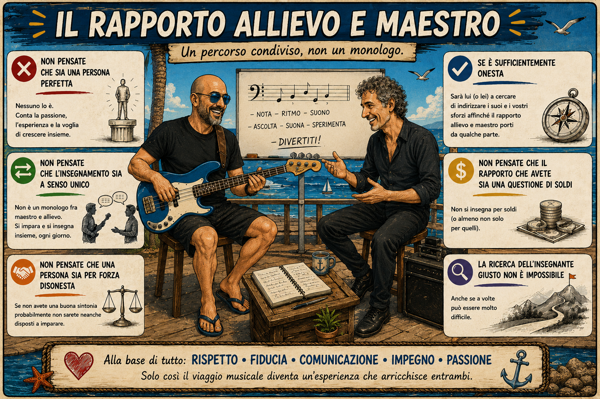
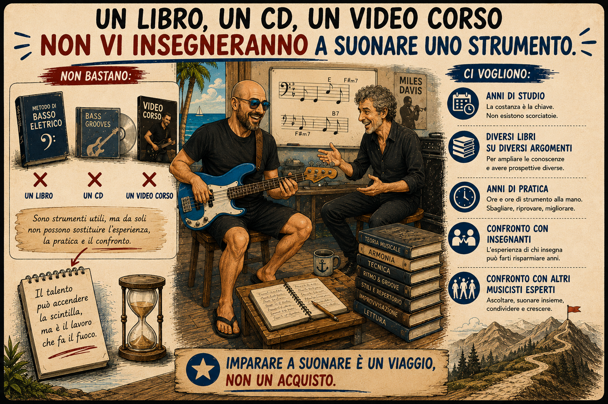
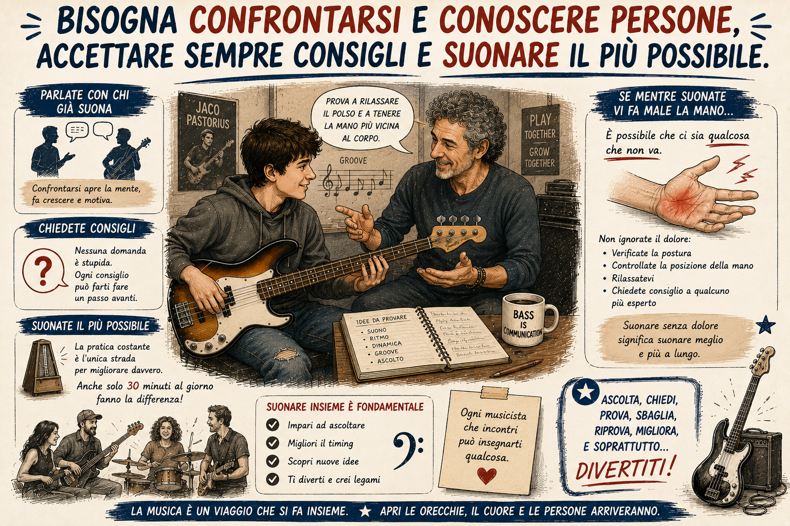
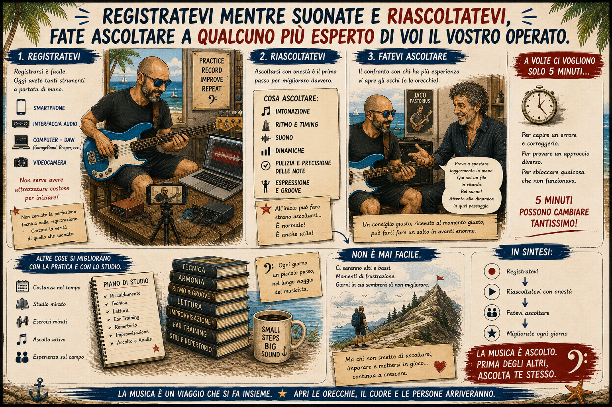
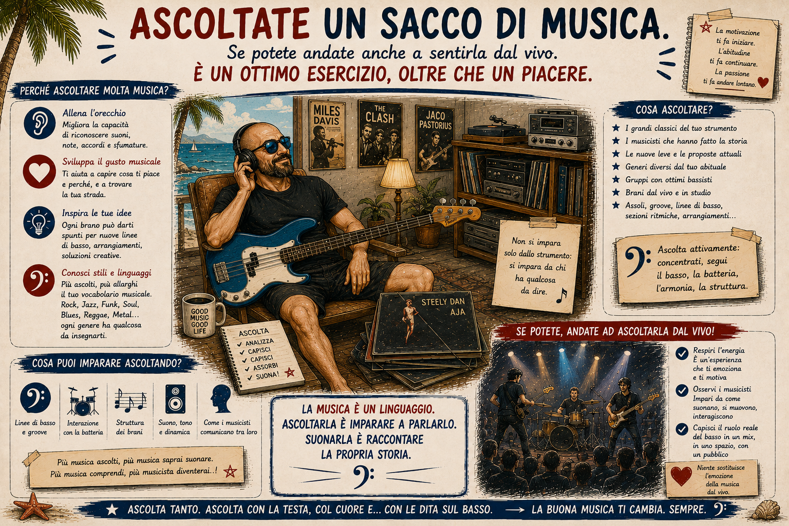
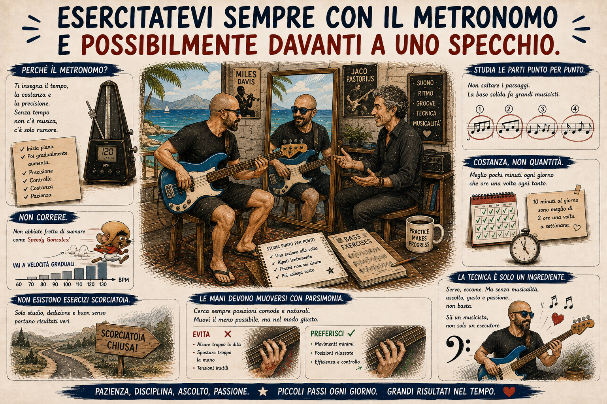

# 2. Consigli utili

Se siete ancora qui è molto probabile che vogliate suonare il basso elettrico. Lasciate che vi dica due parole sullo studio di uno strumento:
 

> [!NOTE]
> Cercate un bravo insegnante (privato o presso una scuola) e, se potete, tenetevelo.

Non pensate che esista la persona perfetta e non pensate che l'insegnamento sia un rapporto a senso unico fra maestro e allievo. Non pensate che chi avete di fronte sia per forza disonesto: se non c'è sintonia, probabilmente non sarete neanche disposti a imparare. Se la persona che vi guida è sufficientemente onesta, sarà lei (o lui) a indirizzare i vostri sforzi affinché il percorso porti da qualche parte. E soprattutto non pensate che sia solo una questione di soldi: non si insegna per soldi, o almeno non soltanto per quelli. La ricerca dell'insegnante giusto non è impossibile, anche se a volte può richiedere del tempo.

> [!WARNING]
> **Un libro, un CD, un video corso non vi insegneranno a suonare uno strumento.**

Ci vogliono anni di studio, manuali di ogni tipo, ore ed ore di pratica, oltre al confronto costante con insegnanti e musicisti più esperti.

> [!TIP]
> *Bisogna confrontarsi e conoscere persone, accettare sempre consigli e suonare il più possibile.*

Parlate con chi suona da prima di voi, chiedete consigli. Se per esempio mentre suonate avvertite dolore alla mano, significa che c'è qualcosa da correggere nell'impostazione.

> [!TIP]
> *Registratevi mentre suonate e riascoltatevi, fate ascoltare a qualcuno più esperto di voi il vostro operato.*

A volte bastano 5 minuti per fare un salto di qualità enorme. Altre cose, invece, richiedono mesi di pratica e studio costante. Non è mai facile, ma fa parte del gioco./p>

> [!NOTE]
> Le scuole di musica generalmente offrono ore di studio teorico con ore di tecnica e un laboratorio di musica di insieme.

Tenete a mente una cosa: frequentare una scuola viva — piena di insegnanti, allievi, laboratori e saggi di fine anno — non serve solo a imparare la tecnica. È il posto ideale per iniziare a masticare la realtà del campo: suonare dal vivo, registrare una demo e affrontare i problemi concreti di chi suona davvero.

> [!TIP]
> *Ascoltate un sacco di musica.*

Se potete andate anche a sentirla dal vivo. È un ottimo esercizio, oltre che un piacere.

> [!TIP]
> *Esercitatevi sempre con il metronomo e possibilmente davanti a uno specchio.*

Non abbiate fretta di suonare come Speedy Gonzales, ma andate a velocità graduali. Studiate le parti punto per punto finché non siete sicuri ed esercitatevi in maniera costante: magari pochi minuti, ma a cadenza regolare, meglio se tutti i giorni. Non esistono esercizi scorciatoia e mi sento di darvi un ultimo, prezioso consiglio: le mani devono muoversi con parsimonia. Cercate sempre posizioni comode, senza sollevare troppo le dita o spostare eccessivamente la mano. La tecnica serve, certo, ma è solo un ingrediente per diventare un bravo musicista.

## Software utile

Personalmente, nel tentativo di migliorare come musicista, oltre alle lezioni e allo studio mi sono impegnato al massimo nella pratica. E per ovviare a tutte le difficoltà che la pratica comporta, ho trovato parecchio utili alcuni software. Si tratta di applicazioni disponibili per qualsiasi aggeggio abbiate in casa, che sia un computer, un tablet o uno smartphone.

**Ear Master** (https://www.earmaster.com/)

Si tratta di un software di Ear Training, ovvero la disciplina che "allena l'orecchio" all'ascolto e al riconoscimento di note, intervalli e accordi. È una parte fondamentale della formazione di ogni musicista, ma il problema è che per praticarla davvero serve essere in due: qualcuno che suona le note e qualcuno che le indovina. È importante che la verifica sia affidabile e soprattutto istantanea, altrimenti un lavoro del genere rischia di diventare improbo e infruttuoso. Questo software aiuta parecchio, poiché è un degno sostituto del lavoro "bovino" che farebbe un insegnante in carne ed ossa. Porta l'allievo avanti in modo progressivo proponendo diversi tipi di esercizi: mostra a schermo il manico di una chitarra, di un basso o la tastiera di un pianoforte, affiancandoli al pentagramma. EarMaster può essere acquistato in diverse versioni, dalla più semplice alla più completa, con funzioni che — oltre all'allenamento dell'orecchio — tracciano le statistiche dei progressi. È una vera e propria scuola digitale, con corsi, esami e punteggi finali.

**iReal Pro** (https://www.irealpro.com)

Questo software ha a che fare con i Real Book e con gli spartiti in generale. Ho già spiegato cosa siano, a cosa servano e quale prezioso contenuto racchiudano. Quello che non ho detto è che sono tanti e decisamente voluminosi — come del resto la maggior parte degli spartiti. Immaginate quindi quanto possa essere utile un programma dedicato. Certo, oggi i fogli di musica esistono in formato digitale e si possono caricare su un e-Reader, un tablet o uno smartphone. Ma se da una parte ci risparmiamo un peso enorme nello zaino, dall'altra ci scontriamo con diversi limiti: spesso i PDF sono difficili da consultare al volo, non permettono di aggiungere note, non consentono di creare scalette veloci né di trasporre i brani in un'altra chiave (non che ce ne sia sempre bisogno, ma tant'è). iReal Pro risolve tutto questo: permette di cercare al volo un pezzo nel repertorio, organizzare scalette per le serate e trasporre qualsiasi brano in qualunque tonalità, il tutto con una semplicità disarmante. Si intuisce facilmente quale enorme aiuto rappresenti per il musicista (o per chi si spaccia per tale!). All'interno dell'applicazione è possibile scrivere un brano da zero oppure prenderne uno esistente e modificarlo. Una volta completata la trascrizione si può anche (cosa lodevolissima, buona e giusta) condividere il proprio lavoro con una nutrita comunità online. È molto probabile che, se cercate uno standard famoso, qualcuno l'abbia già trascritto prima di voi. Ovviamente si possono impostare il tempo di metronomo, la struttura (sezione A, sezione B, ritornelli) e tutto ciò che serve. Ma la vera magia è un'altra: se dovete esercitarvi su un pezzo ma la vostra band non è disponibile, questo geniale attrezzo suonerà al posto loro! Vi accompagnerà con contrabbasso, pianoforte e batteria (o con una combinazione a vostra scelta) con una qualità degna dei migliori arranger (senza pretendere miracoli, eh!). E avrete il controllo totale: potrete accelerare o rallentare i BPM, decidere quante volte ripetere una determinata sezione e cambiare genere al volo, dallo Swing al Rock, fino alla Bossa Nova.

**Musescore** (https://musescore.org/it)

È il miglior software di notazione musicale in circolazione (nonché il più usato) e oggi fa parte di una suite ancora più completa. Ha stracciato in popolarità, semplicità d'uso e completezza — oltre che per il fatto di essere del tutto gratuito — colossi storici come Finale e Sibelius. Sostituisce egregiamente anche quella diarrea di Fronimo per le intavolature degli strumenti antichi. Su MuseScore le intavolature possono essere personalizzate all'inverosimile, permettendo di scrivere per qualsiasi strumento, compresi quelli che ancora non esistono. Ovviamente offre anche la possibilità di riprodurre audio di partiture complete (orchestrali, pop, jazz e chi più ne ha più ne metta) con tutti gli strumenti possibili e immaginabili, restituendo ottimi risultati. Per chi studia il basso, inoltre, ha un paio di assi nella manica non da poco: permette di gestire contemporaneamente pentagramma e intavolatura in perfetta sincronia (cambi una nota e si aggiorna l'altra) e consente di zittire la traccia di basso per crearsi al volo una backing track audio su cui esercitarsi. Se ti trovi a scrivere o ad arrangiare un pezzo per la tua band, scrivi lo spartito generale (es. Basso, Batteria, Chitarra, Voce) e con un semplice click MuseScore genera automaticamente la singola scheda stampabile per il bassista, quella per il batterista, ecc., senza dover ricopiare nulla a mano. Esporta in PDF, MIDI, WAV o MP3 e permette di caricare SoundFont esterni (librerie di suoni). Se il suono del basso di default non ti soddisfa, puoi caricare SoundFont gratuiti dedicati a vari tipi di basso (Fender Precision, Jazz Bass, Contrabbasso) per avere un audio di riproduzione estremamente realistico durante lo studio. Senza contare la sconfinata piattaforma online dove trovare trascrizioni di qualsiasi brano esistente sulla faccia della terra la community condivide ogni giorno.

Un'ultimo software che non può mancare è una <b>Digital Audio Workstation</b> o <b>DAW</b>, ovvero un software che utilizza un interfacce audio e MIDI per poter scrivere, registrare, montare, suonare, tracce musicali. Ce ne sono davvero tanti, sono tutti buoni e tutti cattivi: ProTools, Logic, Cubase, ecc... Sceglietene uno qualsiasi. In genere ce ne sono anche gratuiti (o con funzioni base) inclusi nelle schede audio o direttamente preinstallati. Io dopo averli provati tutti uso <b>Garage Band</b> (https://www.apple.com/it/mac/garageband/).

