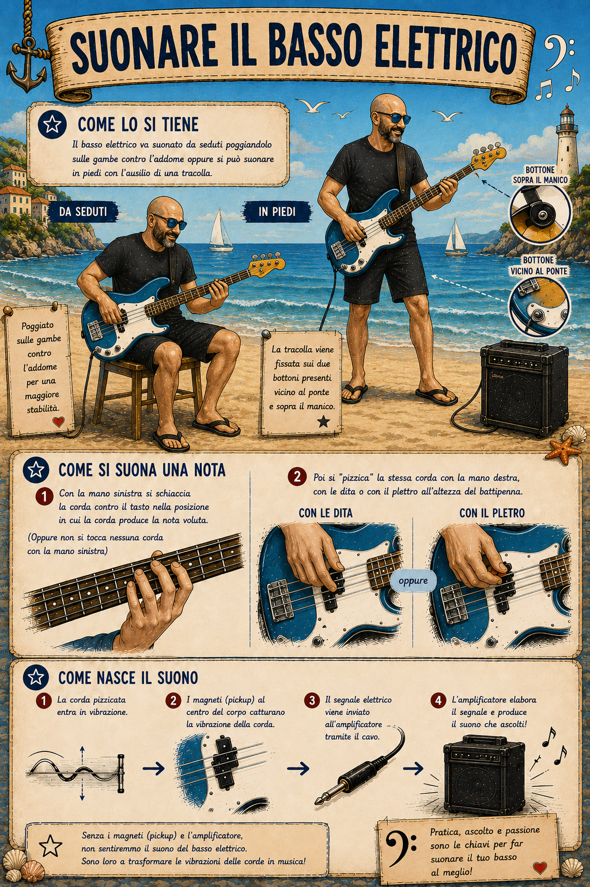
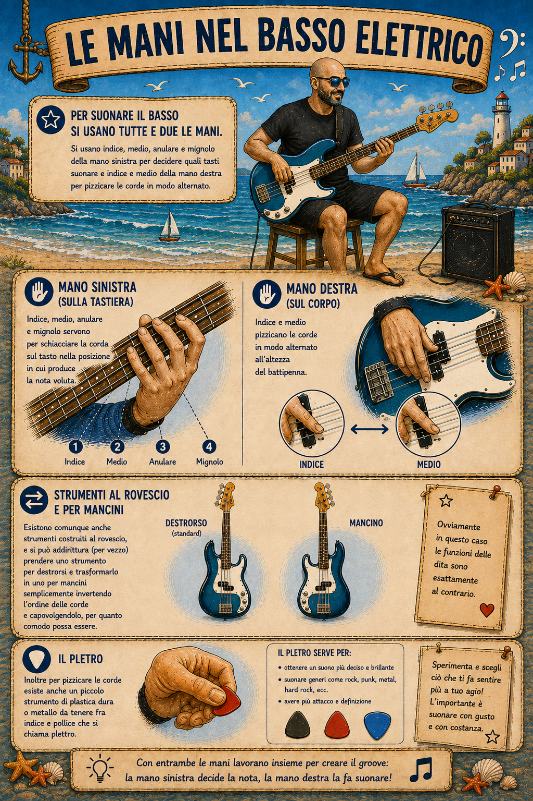
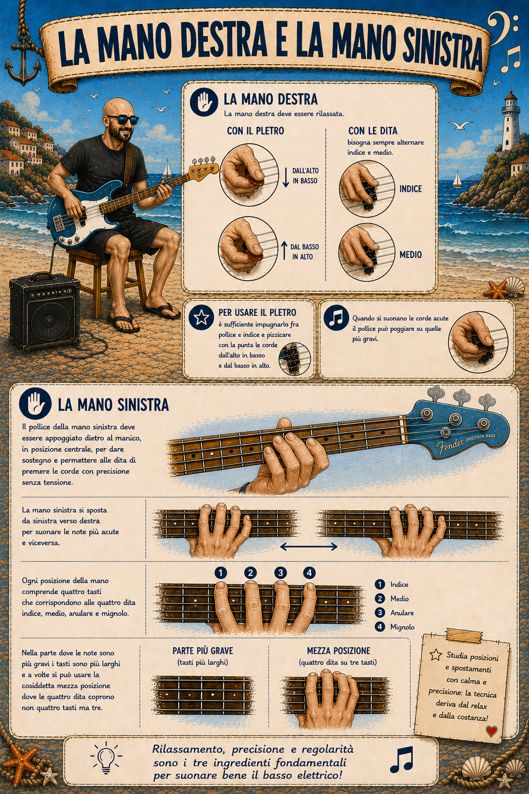

# 3. Com'è fatto il Basso Elettrico?

*"Sì, d'accordo, ma che diavolo è un basso elettrico?…"*

Alzi la mano chi di voi, bassista (o anche semplice persona informata sui fatti), ha dovuto rispondere almeno una volta a questa domanda. Vedo parecchie mani alzate. Ed è ovvio: in genere chi guarda un bassista mentre suona non capisce quali siano i suoni prodotti da quella che, a prima vista, sembra una chitarra.

Durante la mia "carriera" da bassista ho ricevuto un commento da una signora ultraottantenne che secondo me la dice lunghissima sulla natura di questo meraviglioso strumento. La signora Maria (nome di fantasia) era la nonna di uno dei componenti di un gruppo con cui ho strimpellato per un bel po' di tempo quando ero alle prime armi. La povera signora Maria era praticamente costretta ad ascoltare le nostre prove, essendo la proprietaria della villetta in campagna dove ci rifugiavamo la domenica pomeriggio per non dare fastidio a nessuno (tranne che a lei, poveretta). Una domenica ho saltato le prove e i miei impavidi compagni hanno deciso di suonare comunque senza di me, per la gioia della signora Maria. La volta successiva, alla quale mi ero regolarmente presentato, a fine prova la signora Maria mi prende da parte e mi fa: "ancora non ho capito che fai, ma quando non ci sei si sente che manca qualcosa di importante".

Quindi a chi non ha ancora capito a che cosa servite quando suonate il basso, ecco cosa dovete rispondere:

<i>Il <b>basso elettrico</b> è uno strumento della famiglia dei <b>cordofoni</b>, derivato dal <b>contrabbasso</b>, del quale riproduce l'estensione delle note. Il primo basso elettrico della storia per popolarità è il <b>Fender Precision Bass</b>, realizzato da <b>Leo Fender</b> nel <b>1951</b>.</i>

<i>Il <b>basso elettrico</b> è uno strumento più facile da trasportare e amplificare rispetto al <b>contrabbasso</b>. È formato da <b>corpo</b>, <b>manico</b> e <b>paletta</b>. Il corpo ospita dei <b>magneti</b>, i <b>pomelli</b> per regolare il <b>volume</b> e il <b>tono</b>, la <b>presa</b> per collegare il <b>basso elettrico</b> all'<b>amplificatore</b> e il <b>ponte</b>. Il ponte è il punto di ancoraggio delle <b>corde</b> che attraversano corpo, manico e arrivano alla <b>paletta</b>. Il manico del basso ospita la <b>tastiera</b>, che può avere 21 o 24 tasti. È suddivisa con barrette di metallo dette <b>tasti</b> fissate sul manico (ma alcuni non ce le hanno, i cosiddetti bassi senza tasti, chiamati <b>fretless</b>) e contrassegnata da <b>segni di posizionamento</b> (dei pallini) sopra il manico e sul bordo del manico, tutti all'altezza del <b>3°</b>, <b>5°</b>, <b>7°</b>, <b>9°</b>, <b>12°</b>, <b>15°</b>, <b>17°</b>, <b>19°</b>, <b>21°</b> e <b>24°</b> tasto. L'intervallo fra due barrette, ovvero il tasto, corrisponde a un semitono. Alla fine del manico c'è il <b>capotasto</b>. Il manico può avere una <b>scala regolare</b> o una <b>scala corta</b>. All'estremità del manico c'è la paletta, la quale ospita le <b>meccaniche</b>, dove vengono avvolte le corde. Le meccaniche servono ad accordare le corde del basso elettrico. Ruotandole in senso <b>antiorario</b> si <b>aumenta</b> l'intonazione, in senso <b>orario</b> si <b>diminuisce</b>.</i>

<i>Il <b>basso elettrico</b> va suonato da <b>seduti</b> poggiandolo <b>sulle gambe contro l'addome</b> oppure si può suonare <b>in piedi</b> con l'ausilio di una <b>tracolla</b> che viene <b>fissata sui due bottoni</b> presenti vicino al ponte e sopra il manico. Per suonare una nota bisogna <b>premere la corda contro il tasto</b> con le <b>dita della mano sinistra</b>, nella posizione in cui la corda produce la nota voluta (oppure non si tocca nessuna corda con la mano sinistra) <b>e poi si "pizzica"</b> la stessa corda con <b>la mano destra</b>, <b>con le dita</b> o <b>con il plettro</b> all'altezza del <b>batti penna</b>. I <b>magneti</b> al centro del corpo catturano la <b>vibrazione</b> creata dalla corda e <b>l'amplificatore</b> produce il <b>suono</b>.</i>

<i>Per suonare il basso si usano <b>tutte e due le mani</b>. Si usano <b>indice</b>, <b>medio</b>, <b>anulare</b> e <b>mignolo</b> della <b>mano sinistra</b> per decidere <b>quali note suonare</b> e <b>indice</b> e <b>medio</b> della <b>mano destra</b> per <b>pizzicare</b> le corde in modo <b>alternato</b>. Esistono comunque anche strumenti costruiti al rovescio. In questo caso le funzioni delle dita sono esattamente al contrario. Inoltre per <b>pizzicare</b> le corde esiste anche un piccolo strumento di plastica dura o metallo da tenere fra indice e pollice che si chiama <b>plettro.</b> che va usato dall'<b>alto verso il basso</b> e dal <b>basso verso l'alto</b>, sempre in maniera <b>alternata</b>.</i>

<i>La <b>mano destra</b> deve essere <b>rilassata</b>. L'uso delle dita <b>indice</b> e <b>medio</b> alternate si aiuta poggiando il <b>pollice</b> sul <b>magnete</b> o <b>sulle corde più gravi</b>. Il <b>pollice</b> della <b>mano sinistra</b> deve essere <b>leggermente piegato</b> e <b>appoggiato sul manico</b>. La <b>mano</b> forma un <b>arco</b> e le <b>dita</b> si posizionano <b>a martello</b>. Non devono essere <b>troppo sollevate</b> rispetto alle corde. La <b>mano sinistra</b> si <b>sposta</b> da sinistra verso destra per suonare le <b>note più acute</b> e <b>viceversa</b>. Ogni <b>posizione</b> della mano comprende <b>quattro tasti</b> che corrispondono alle <b>quattro dita</b> indice, medio, anulare e mignolo. Nella parte dove le note sono più <b>gravi</b> i tasti sono più <b>larghi</b> e a volte si può usare la cosiddetta <b>mezza posizione</b> dove le <b>quattro dita</b> coprono non quattro ma <b>tre tasti</b>.</i>

Semplice no?
