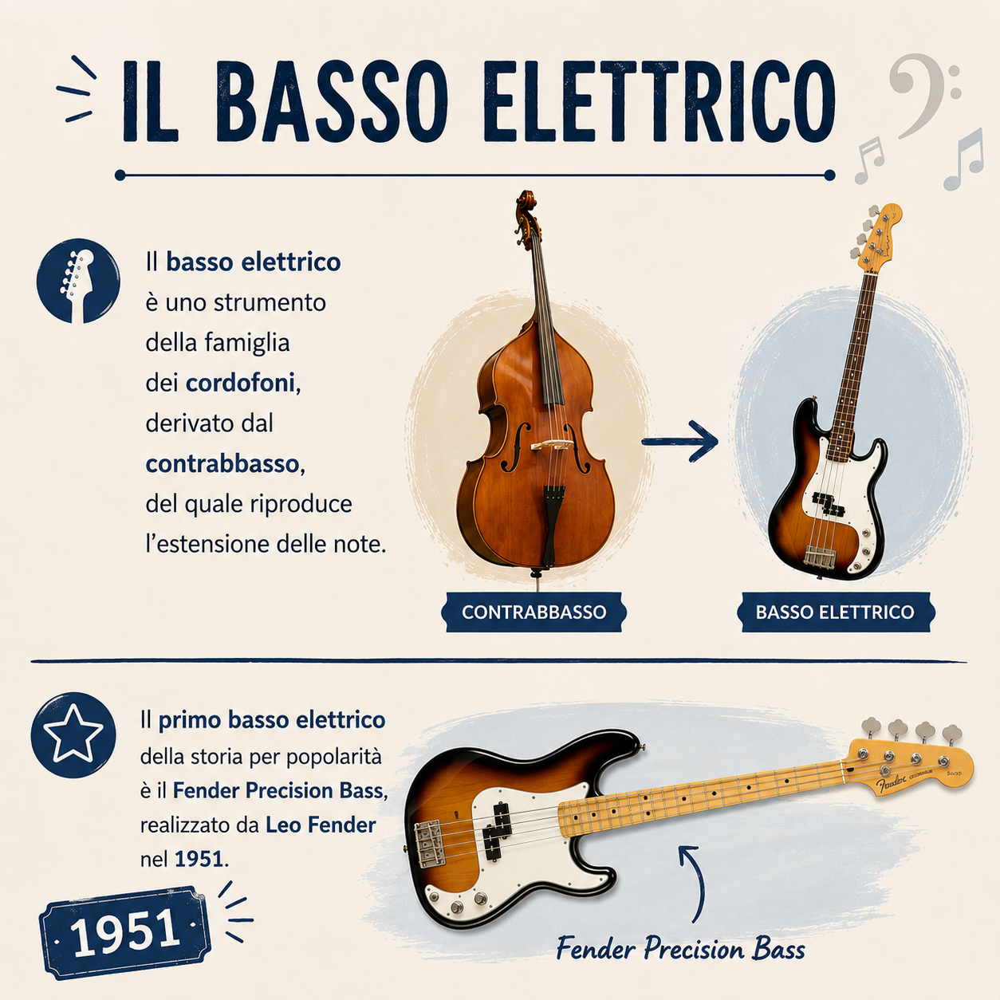
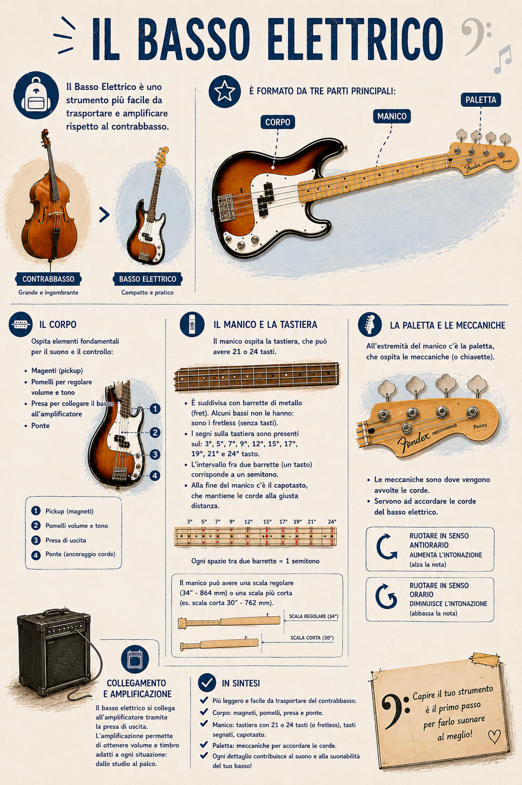
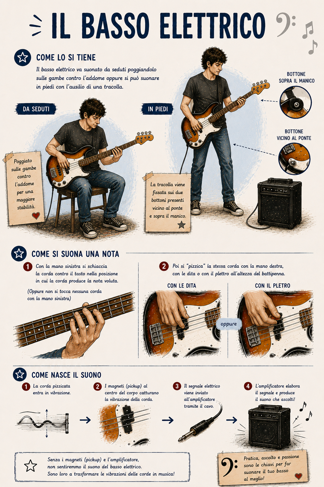
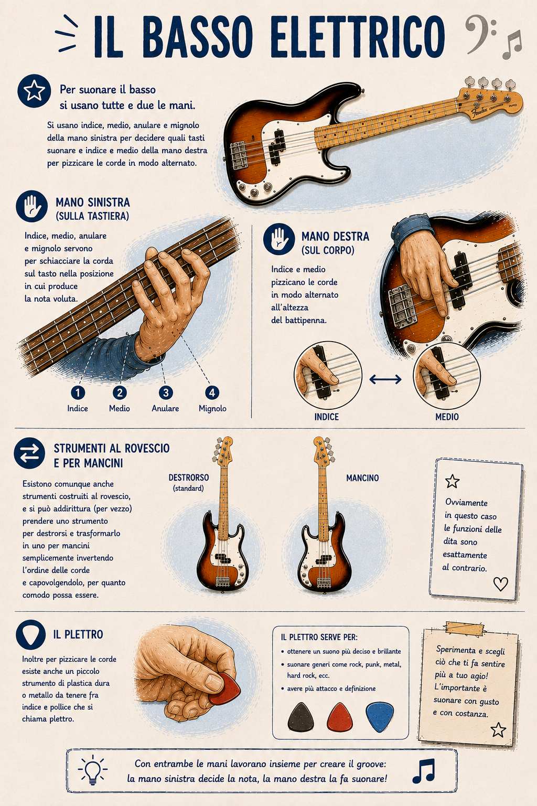
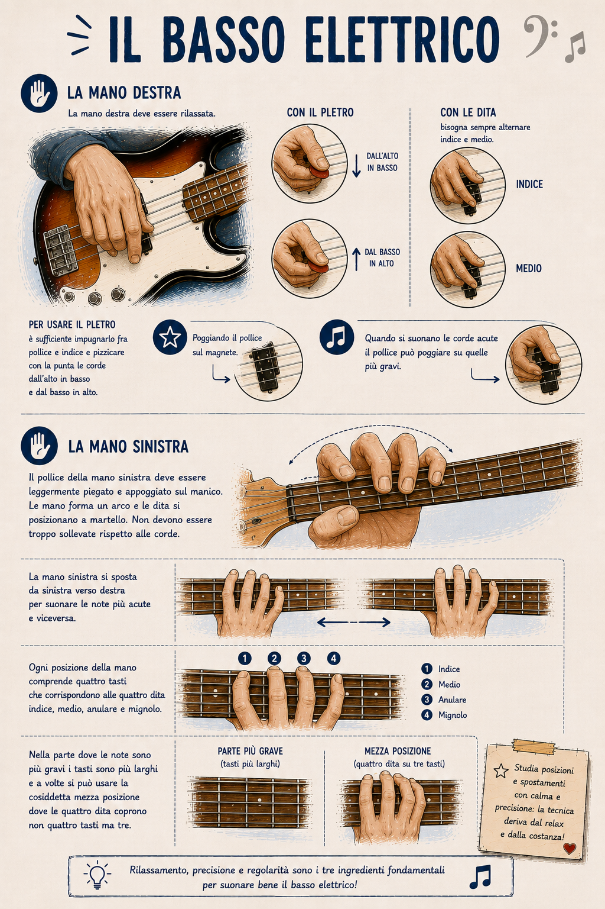

# 3. Com'è fatto il Basso Elettrico?

"Sì, d'accordo, ma che diavolo è un basso elettrico?…". Alzi la mano chi di voi, bassista (o anche persona informata sui fatti) ha dovuto rispondere a questa domanda. Vedo parecchie mani alzate. Ed è ovvio: in genere una persona che guarda il bassista mentre suona non capisce quali sono i suoni che escono dalla quella che sembra una chitarra.

Durante la mia "carriera" di bassista ho ricevuto un commento da una signora ultra ottantenne che secondo me la dice lunga sulla natura di questo meraviglioso strumento. La signora Maria (nome di fantasia) è la nonna di uno dei componenti di un gruppo con il quale ho strimpellato per un bel po' di tempo. La povera signora Maria era praticamente costretta ad ascoltare le prove, in quanto proprietaria della villetta di campagna dove ci recavamo per suonare la domenica pomeriggio, perché lì non davamo fastidio a nessuno (tranne alla signora di cui sopra). Una volta ho saltato una prova, e i miei impavidi compagni hanno comunque deciso di provare senza di me, per la gioia della signora Maria. La volta successiva, alla fine della prova, alla quale questa volta mi ero regolarmente presentato, la signora Maria mi prende da parte e mi fa: "ancora non ho capito che fai, ma quando non ci sei si sente che manca qualcosa di importante".

Quindi a chi non ha ancora capito a che cosa servite quando suonate il basso, ecco cosa dovete rispondere:

<i>Il basso elettrico è uno strumento della famiglia dei cordofoni, derivato dal contrabbasso, del quale riproduce l'estensione delle note. Il primo basso elettrico della storia per popolarità è il Fender Precision Bass, realizzato da Leo Fender nel 1951.</i>

<i>Il Basso Elettrico è uno strumento più facile da trasportare e amplificare rispetto al contrabbasso. È formato da corpo, manico e paletta . Il corpo ospita dei magneti, i pomelli per regolare il volume e il tono, la presa per collegare il basso elettrico all'amplificatore e il ponte. Il ponte è il punto di ancoraggio delle corde che attraversano corpo, manico e arrivano alla paletta. Il manico del basso ospita la tastiera, che può avere 21 o 24 tasti. È suddivisa con barrette di metallo fissate sul manico (ma alcuni non ce le hanno, i cosiddetti bassi senza tasti, detti *fretless*) e contrassegnata dei segni sul 3°, 5°, 7°, 9°, 12°, 15°, 17°, 19°, 21° e 24° tasto. L'intervallo fra due barrette, ovvero il tasto, corrisponde a un semitono. Alla fine del manico c'è il capotasto. La tastiera può  Il manico può avere una scala regolare o una scala più corta. All'estremità del manico c'è la paletta, la quale ospita le meccaniche, dove vengono avvolte le corde. Le meccaniche servono ad accordare le corde del basso elettrico. Ruotandole in senso antiorario si aumenta l'intonazione, in senso orario si diminuisce.</i>

<i>Il basso elettrico va suonato da seduti poggiandolo sulle gambe contro l'addome oppure si può suonare in piedi con l'ausilio di una tracolla che viene fissata sui due bottoni presenti vicino al ponte e sopra il manico. Per suonare una nota si schiaccia la corda contro il tasto con le dita della mano sinistra, nella posizione in cui la corda produce la nota voluta (oppure non si tocca nessuna corda con la mano sinistra) e poi si "pizzica" la stessa corda con la mano destra, con le dita o con il plettro all'altezza del battipenna. I magneti al centro del corpo catturano la vibrazione creata dalla corda e l'amplificatore produce il suono.</i>

<i>Per suonare il basso si usano tutte e due le mani. Si usano indice, medio, anulare e mignolo della mano sinistra per decidere quali tasti suonare e indice e medio della mano destra per pizzicare le corde in modo alternato. Esistono comunque anche strumenti costruiti al rovescio, e si può addirittura (per vezzo) prendere uno strumento per destrorsi e trasformarlo in uno per mancini semplicemente invertendo l'ordine delle corde e capovolgendolo, per quanto comodo possa essere. Ovviamente in questo caso le funzioni delle dita sono esattamente al contrario. Inoltre per pizzicare le corde esiste anche un piccolo strumento di plastica dura o metallo da tenere fra indice e pollice che si chiama <b>plettro.</b></i>

<i>La mano destra deve essere rilassata. Per usare il plettro è sufficiente impugnarlo fra pollice e indice e pizzicare con la punta le corde dall'alto in basso e dal basso in alto. Se invece si usano le dita bisogna sempre alternare indice e medio, poggiando il pollice sul magnete. Quando si suonano le corde acute il pollice può poggiare su quelle più gravi. Il pollice della mano sinistra deve essere leggermente piegato e appoggiato sul manico. Le mano forma un arco e le dita si posizionano a martello. Non devono essere troppo sollevate rispetto alle corde. La mano sinistra si sposta da sinistra verso destra per suonare le note più acute e viceversa. Ogni posizione della mano comprende quattro tasti che corrispondono alle quattro dita indice, medio, anulare e mignolo. Nella parte dove le note sono più gravi i tasti sono più larghi e a volte si può usare la cosiddetta <b>mezza posizione</b> dove le quattro dita coprono non quattro tasti ma tre.</i>

Semplice no?

