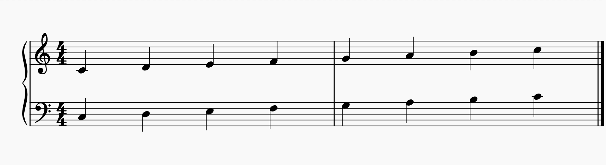

# 5. Cenni di Teoria Musicale

Non possiamo continuare a suonare senza sapere un accidenti di niente sulla musica. Dobbiamo proseguire sapendo almeno le basi. Quindi bambini adesso cercheremo di imparare tutte le paroline che ci serviranno per affrontare seriamente lo studio della teoria musicale, che altri non è che la disciplina che ci aiuta a scrivere, leggere e capire come si <i>muove</i> la musica.
 

Le note sono suoni, e il suono di per sé ha sfumature infinite (come il colore). Consideriamo le quattro caratteristiche fondamentali del suono: <b>timbro</b>, <b>altezza</b>, <b>durata</b> e <b>intensità</b>.

Il <b>timbro</b> è la caratteristica che viene data dallo strumento stesso. Un corpo messo in vibrazione ha una serie di caratteristiche a seconda del materiale con cui il corpo vibrante è costruito. Se sollecitiamo un pezzo di legno o di metallo, percepiamo una differenza, a prescindere dalla durata, dall'intensità e dell'altezza del suono. Se un pianoforte e una chitarra suonano un C4 siamo in grado di capire che la nota è la stessa, ma il suono è prodotto da due strumenti diversi. Questo è il timbro.

Le altre caratteristiche (<b>altezza</b>, <b>durata</b> e <b>intensità</b>) si possono descrivere per poter poi essere rilette e riprodotte. Nei secoli ci sono stati diversi metodi per scrivere la musica, e un paio di questi sono arrivati fino a noi: il <b>pentagramma</b> e l'<b>intavolatura</b>.

Il <b>pentagramma</b> è la notazione musicale per eccellenza, valida per tutti gli strumenti musicali come ad esempio la voce. Si tratta di cinque linee chiamate <b>righi</b> (non righe, righi) separati da quattro <b>spazi</b>. Una nota viene rappresentata con una testa, un gambo e una o più code che ne determinano la durata. L'altezza della nota è invece determinata dal rigo o spazio sul quale poggia. L'altezza può essere modificata dagli accidenti e quindi parliamo di <b>alterazione</b>. Ogni alterazione è scritta a sinistra di ogni nota. L'intensità la vedremo dopo.

Questo che segue è un pentagramma. Viene usato per scrivere le note suonate da uno strumento con una registro come archi e fiati. Le note che vedete sono C4, D4, E4, F4, G4, A4 e B4. Il simbolo in fondo a forma di "f" rappresenta una pausa.

Quest'altro invece è un <b>doppio pentagramma</b>, l'unione di due pentagrammi uniti con una parentesi graffa. Viene usato per scrivere le note suonate da strumenti con un registro esteso come pianoforte e arpa. Le note sul pentagramma più in basso sono C3, D3, E3, F3, G3, A3 e B3 e le altre sono sempre C4, D4, E4, F4, G4, A4 e B4. Attenzione: non va suonata prima la riga sopra e poi quella sotto! Bisogna suonare C3 e C4 insieme, D3 e D4 insieme, ecc…

La <b>chiave</b> è quel simbolo che si mette all'inizio di ogni pentagramma e serve a determinare il registro, basso o acuto. Si usano comunemente chiave di <b>violino</b> (o chiave di SOL) per le note acute (quella a forma di s rovesciata con un ricciolo) e chiave di <b>basso</b> (o chiave di FA) per le note basse (quella a forma di c rovesciata con due puntini). La chiave di violino poggia sul quarto rigo, ovvero il SOL che viene dopo il C4 (G4) e quella di basso poggia sul secondo rigo, ovvero il FA prima del C4 (F3).

Esiste anche una terza chiave detta di DO (che ha una forma indescrivibile, ma ne trovate un esempio dopo) che viene usata per particolari partiture che utilizzano il sistema del DO mobile (che indicherà sempre il C4) e con delle regole differenti per i registri vocali maschili (tenore, baritono e basso) e femminili (soprano, mezzosoprano e contralto). Se dovessimo collocarla nel doppio pentagramma di cui sopra sarebbe esattamente al centro, dove poggia il "taglio" del C4, fra chiave di violino e di basso.

Ah, dimenticavo: per le note del basso elettrico si usa la chiave di basso! Ma dovete saper leggere anche la chiave di violino, non avete scuse!

Come si può vedere, ci sono due scale che vanno da C a B: quella che parte da C3 e quella che parte da C4. Però le note sono posizionate in maniera diversa. C4 è sotto il primo rigo della chiave di violino e C3 è nel secondo spazio nella chiave di basso. Dite la verità, speravate che le note fossero nello stesso posto anche in chiavi diverse, vero?

Se una nota è più alta o più bassa di quelle rappresentabili sul rigo si usano dei tagli addizionali. Il DO centrale (C4) è il taglio addizionale in alto sulla chiave di basso e in basso su quella di violino. Nelle due figure sopra potete vedere che la prima nota è un C4 e infatti la testa "tagliata" in due da una piccola linea. Se il pentagramma non ci basta possiamo usare ulteriori tagli addizionali. Guardate qui:

Questa figura mostra la posizione (rispetto a ogni chiave) di tutti i DO di tutte le ottave che i dotti medici e sapienti hanno stabilito per noi udibili.

  

E adesso un'altra:

Questa figura mostra la corrispondenza delle note sul pentagramma con i tasti del basso elettrico.

La <b>durata</b> di una nota (o di una pausa) si specifica con la forma della nota (o della pausa) stessa, e viene indicata in senso relativo (un quarto, un ottavo, ecc…). Più tardi sarà più chiaro a cosa si riferisce il rapporto di un quarto o un ottavo. Come vedete le note hanno una testa "vuota" o "piena" e possono avere o meno un gambo, con o senza una o più code. La direzione del gambo è verso l'alto se la nota è sotto il rigo centrale (qualunque sia la chiave) o verso il basso se la nota si trova dal rigo centrale in su (rigo centrale compreso):

Le note vengono raggruppate in <b>misure</b> (o <b>battute</b>) separate da barrette verticali che attraversano il pentagramma. Il <b>tempo</b> è la suddivisione delle misure con il quale pulsa la musica e viene indicato all'inizio e accanto alla chiave sotto forma di frazione. Stabilisce all'interno di una misura quante e quali note (e pause) sono contenute, ovvero il <b>battito</b> o <b>movimento</b>. Il numeratore indica di quanti movimenti è fatta una misura e il denominatore indica la durata di ogni movimento. Es. 4/4 vuol dire che una misura è formata da 4 semiminime (o altre note che in totale danno una durata equivalente). 12/8 vuol dire che una misura è composta da 12 crome (idem come sopra).

Le durate di cui sopra hanno il rapporto di un intero o di una frazione di un intero. Questo significa che le note non durano più di una misura. Esistono però anche delle durate non più usate:

Forse la fusa la potreste trovare, ma le altre note no. Se dobbiamo scrivere un suono che dura più di una misura usiamo comunque una semibreve e una <b>legatura di valore</b> con un'altra nota. Una legatura di valore è una linea curva che lega due note. Oltre due note in due misure diverse può collegare due note anche nella stessa misura. Con questo sistema è possibile scrivere note che durano ad esempio 9/8 (si lega una nota da un ottavo con una da un quarto). Inoltre è possibile aumentare la durata di una nota mettendo a fianco alla nota da uno a tre punti con la <b>legatura di punto</b>. Un punto aggiunge la metà della durata, due punti la metà più un quarto e tre punti la metà più un quarto più un ottavo. Es. Una minima con un punto durerà 2/4+1/4=3/4. Una semibreve con due punti durerà 4/4+2/4+1/4=7/4. Una semiminima con tre punti durerà 1/4+1/8+1/16.

Qualche esempio:

Entrambi gli esempi hanno un tempo di 4/4. Nel primo esempio si vede un G#2 che dura 8/4. Nel secondo esempio abbiamo due misure scandite da 4 minime (A3) e delle note sopra (E4) che durano la prima 3/8 (una semiminima con la legatura di punto = 1/4+1/8), la seconda nota 1/4 (due crome con una legatura di valore = 1/8+1/8) e le altre a seguire. Infatti 2 minime = 4/4, due semiminime col punto + due crome legate = 4/4 e due semiminime col punto + una semiminima = 4/4.

Attenzione perché esistono anche altri tipi di legature: la legatura di frase è una linea curva posta sopra o sotto tre o più note, con lo scopo di indicare all'esecutore che le note non devono essere suonate staccate una dall'altra, ma unite una subito dopo l'altra, con un'unica emissione di fiato (nel caso degli strumenti a fiato) o facendo scivolare le dita (nel caso del pianoforte o di uno strumento a corda). L'effetto che si crea è detto legato.

Un esempio classico di legatura di frase è l'inizio della Rapsodia in Blue di George Gershwin, dove 17 semibiscrome sono legate insieme:

Attenzione perché la curva del legato può trarvi in inganno! Vedete quel "3" sotto la curva della legatura di frase nei due gruppi di tre crome nella seconda misura? Non è un legato, ma una terzina. Vuol dire che le tre note saranno suonate con la durata complessiva di una semiminima (cioè 1/4, la quarta parte del movimento). Se fate i conti tornano, come tornano per la "diciassettina" della prima misura (sì, se guardate bene c'è scritto: 17).

Inoltre non confondete il punto del legato con quello dello staccato! Lo staccato è un simbolo che indica che la nota deve essere suonata separandola dalle altre, l'esatto contrario del legato. Guardate le due terzine della seconda misura (quelle che paradossalmente sembrano legate) sono invece staccate, e cioè le tre note racchiuse devono essere eseguite "slegate" l'una dall'altra e nel tempo complessivo di 1/4. Il punto dello staccato è sopra la nota e non di fianco.

Nelle figure di esempio sopra, nel pentagramma semplice e doppio, abbiamo due misure. Inoltre abbiamo un simbolo "C" che indica che la suddivisione delle misure. Quel simbolo è detto comune, cioè il classico quattro quarti. Quindi in una misura da 4/4 potremo mettere una nota che dura 4/4, due da 2/4, quatto da un quarto, otto da 1/8, sedici da 1/16, e così via, come anche una combinazione di esse, fino a totalizzare appunto 4/4. Negli esempi infatti ci sono 7 note e una pausa da 1/4.

La <b>velocità</b> o (<b>tempo di metronomo</b>) stabilisce la durata di ogni nota. Una nota può durare un quarto, ma un quarto di cosa? Di un secondo? Di un ora? La velocità si indica con una durata di riferimento e un numero. Il numero rappresenta i <b>battiti al minuto</b> <i>bpm</i> per la durata specificata. Es. Se abbiamo un tempo di 4/4 e una semiminima viene suonata a 120 bpm vuol dire che in un minuto trovano posto 120 note per un totale di 30 misure. La velocitàv quindi scandisce il numeratore del tempo con un battito. Una misura di 4/4 a 120 bpm scandisce quattro battiti e ogni battito dura il tempo di una semiminima, cioè mezzo secondo.

Un ultimissimo concetto: la <b>dinamica</b>. Ovvero modulare l'<b>intensità</b> di un suono. Vi ricordo che <b>intensità</b> e <b>volume</b> sono due cose differenti. L'intensità di un suono modifica il timbro del suono stesso arricchendolo di armonici, mentre il volume, che non è una caratteristica intrinseca del suono ma del segnale amplificato, ne aumenta la forma d'onda che di per sé è già formata. Se suoniamo un accordo di pianoforte delicatamente oppure con vigore otterremo lo stesso accordo, il primo meno intenso e con un timbro meno ricco di armonici. Se aumentiamo il volume dell'accordo suonato piano avremo un risultato differente da quello suonato più vigorosamente. La dinamica viene annotata sotto il pentagramma con apposite sigle in carattere corsivo, più precisamente chiamate <b>segni di espressione</b> oppure <b>segni dinamici</b>. Essi sono, dalla minima alla massima dinamica: <b>ppp</b> (più che pianissimo), <b>pp</b> (pianissimo), <b>p</b> (piano), <b>mp</b> (mezzopiano), <b>mf</b> (mezzoforte), <b>f</b> (forte), <b>ff</b> (fortissimo), <b>fff</b> (più che fortissimo). Il cambiamento di dinamica può essere improvviso (talvolta indicato esplicitamente con la sigla <b>subito</b>) oppure progressivo. In questo caso si usano espressioni testuali come <b>crescendo</b> e <b>diminuendo</b>, talvolta accompagnate da <b>poco a poco</b>. Spesso si preferisce notare delle "forcelle", ovvero coppie di linee orizzontali che si allontanano (dipartendosi da un punto indicano un <b>crescendo</b>) o si avvicinano (chiudendosi in un punto indicano il <b>diminuendo</b>). Potete vedere un esempio sopra la minima della seconda misura della Rapsodia in Blue di Gershwin. Mentre la durata è relativa al tempo di metronomo, la dinamica è relativa e basta. Nonostante i computer abbiano un'idea precisa e misurabile della dinamica, queste indicazioni sono relative al gusto interpretativo del musicista che le esegue.

L'altro sistema di scrittura si chiama <b>intavolatura</b>. Mentre il pentagramma rappresenta la nota che si deve suonare, l'intavolatura rappresenta la posizione delle dita sulla tastiera di uno strumento a corda come il liuto, la tiorba, il basso o la chitarra. Nel caso del basso elettrico è formata da 4 (o 5) linee che rappresentano le 4 (o 5) corde del basso, dalla più acuta alla più grave. Il numero indicato su ogni rigo indica il tasto che va premuto (0 per la corda a vuoto), mentre in basso si può indicare con un numero da uno a quattro il dito della mano sinistra da usare per premere il tasto. Esistono poi altri simboli che si usano per indicare l'applicazione di una certa tecnica delle dita della mano sinistra o destra. I tasti da suonare sono in successione sulle note e ogni numero rappresenta una nota, sia in una melodia che in un accordo. A torto si pensa che l'intavolatura è una invenzione recente creata per i musicisti pigri che non vogliono imparare a leggere uno spartito. L'intavolatura risale al XVI secolo, mentre il pentagramma risale comunque al IX secolo. Non mi dilungherò sull'intavolatura (che vi consiglio caldamente di usare all'inizio solo per aiutarvi a leggere il pentagramma), ometto tutta una serie di simboli che afferiscono alla durata delle note e all'espressione che a mio avviso possono essere annotati benissimo sul pentagramma. Ecco un esempio di pentagramma e intavolatura:

Attenzione ai termini anglosassoni! Sono falsi amici! Se vi capita un libro in inglese sarà più facile per voi leggerlo se conoscete bene i seguenti termini:

<ul>
<li>Il pentagramma si dice <b>staff</b>;</li>
<li>L'intavolatura si dice <b>tablature</b> (per gli amici <b>tab</b>);</li>
<li>La durata si dice <b>duration</b>;</li>
<li>L'altezza si dice <b>pitch</b>;</li>
<li>L'alterazione si dice <b>accidental</b>;</li>
<li>La chiave si dice <b>clef</b>;</li>
<li>La tonalità si dice <b>key</b>;</li>
<li>La misura si dice <b>measure</b>;</li>
<li>La battuta si dice <b>bar</b>;</li>
<li>Il tempo si dice <b>signature</b>;</li>
<li>Il battito si dice <b>beat</b>;</li>
<li>La legatura di valore si dice <b>tie across the barline</b> quando si legano note fra due misure o <b>tie across the beat</b> quando si legano note nella stessa battuta;</li>
<li>La legatura di punto si dice <b>augmentation</b>;</li>
<li>La nota con il punto si dice <b>dotted note</b>;</li>
<li>La legatura di frase si dice <b>portamento</b> o <b>legato</b>;</li>
<li>La terzina si dice <b>triplet</b>;</li>
<li>Lo staccato si dice <b>staccato</b>;</li>
<li>La velocità del branco si dice <b>tempo</b> e si misura in bpm (beats per minute);</li>
<li>La dinamica si dice <b>velocity</b>;</li>
<li>Il diesis si dice <b>sharp</b>;</li>
<li>Il bemolle si dice <b>flat</b>;</li>
<li>Il bequadro si dice <b>natural sig</b>.</li>
</ul>
