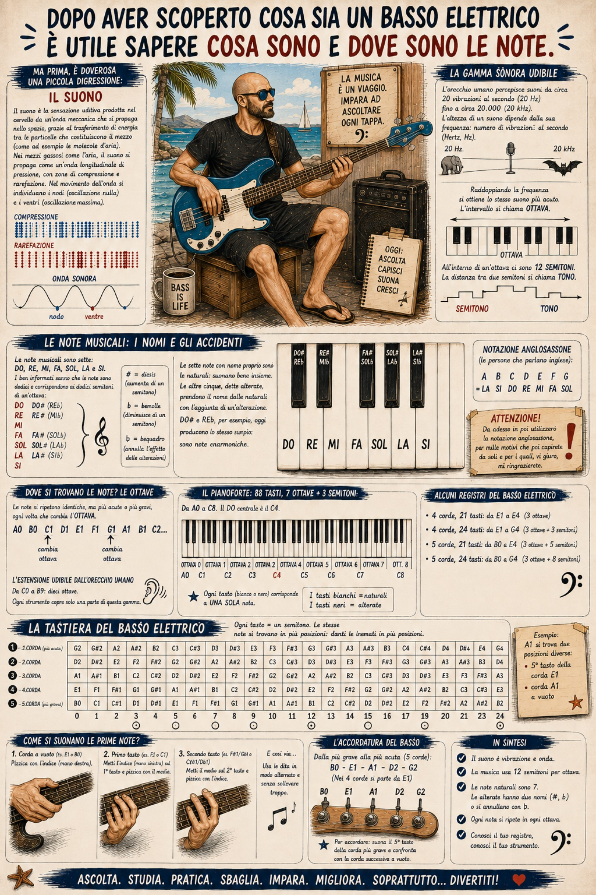

# 5. Note Fantastiche (e dove trovarle)

<p align="justify">Dopo aver scoperto cosa sia un basso elettrico è utile sapere cosa sono e dove sono le <b>note</b>.</p>

<p align="justify">Ma prima, è doverosa una piccola digressione sul suono.</p>

> [!NOTE]
><p align="justify"><i>Il suono è la sensazione uditiva prodotta nel cervello da un’onda meccanica che si propaga nello spazio, grazie al trasferimento di energia tra le particelle che costituiscono il mezzo (come ad esempio le molecole d’aria). La sorgente del suono è qualsiasi corpo che, vibrando, mette in movimento le molecole con cui si trova a contatto, facendole oscillare attorno alla loro posizione di equilibrio. Nei mezzi gassosi come l’aria, il suono si propaga come un’onda longitudinale di pressione, caratterizzata da un'alternanza continua di zone di compressione (dove le molecole si avvicinano) e di rarefazione (dove le molecole si allontanano). Nel movimento dell'onda si individuano i nodi, ossia i punti in cui l'oscillazione è nulla, e i ventri, dove l'ampiezza dell'oscillazione raggiunge il suo massimo.</i></p>

<p align="justify">Nonostante i suoni in natura appartengano a una gamma molto vasta, noi poveri mortali siamo in grado di utilizzarne solo una parte. La <b>gamma sonora</b> dei <b>suoni udibili</b> dall'orecchio umano comprende solo determinati <b>intervalli</b>. Le sfumature presenti fra un intervallo e l'altro non sono facilmente distinguibili, soprattutto da un orecchio non <i>educato</i>. Si individua l'altezza di un suono tramite la sua <b>frequenza</b>, ovvero contando il numero di vibrazioni al secondo emesse dal corpo vibrante; la sua unità di misura è l'<b>Hertz</b> (<b>Hz</b>). La <b>gamma sonora udibile</b> va da circa <b>venti vibrazioni al secondo</b> (<b>20 Hz</b>) fino a circa <b>ventimila</b> (<b>20 kHz</b>). Se prendiamo un suono e raddoppiamo la sua frequenza, otteniamo lo stesso suono un'<b>ottava</b> più acuta. All'interno di un'<b>ottava</b> si distinguono <b>dodici</b> diverse gradazioni, ciascuna delle quali prende il nome di <b>semitono</b>. L'intervallo composto da due semitoni forma un <b>tono</b>.
</p>

<p align="justify">Tutti sappiamo che la musica si fa con le <b>note musicali</b>, e tutti sappiamo che le note sono sette: <b>DO</b>, <b>RE</b>, <b>MI</b>, <b>FA</b>, <b>SOL</b>, <b>LA</b> e <b>SI</b>. I ben informati sanno qualcosa in più: le note complessive sono dodici e corrispondono ai dodici semitoni che compongono un'ottava. La <b>scala cromatica</b> completa è quindi formata da: <b>DO</b>, <b>DO#</b> (o <b>REb</b>), <b>RE</b>, <b>RE#</b> (o <b>MIb</b>), <b>MI</b>, <b>FA</b>, <b>FA#</b> (o <b>SOLb</b>), <b>SOL</b>, <b>SOL#</b> (o <b>LAb</b>), <b>LA</b>, <b>LA#</b> (o <b>SIb</b>) e <b>SI</b>.</p>

<p align="justify">Ma perché sette e poi dodici? E perché DO, RE, MI, FA, ecc…? Chi è il diesis e chi è il bemolle?</p>

<p align="justify">Nei secoli dei secoli dei secoli, le teorie musicali hanno fatto talmente tanto a botte che oggi a noi è arrivato un sistema che attribuisce un nome proprio soltanto a sette note, dette <b>note naturali</b>. Le restanti cinque si chiamano <b>note alterate</b> e prendono il nome dalle note naturali con l'aggiunta delle <b>alterazioni</b> (dette anche <i>accidenti</i>). Non mi riferisco ai malanni o ai malauguri, ma a dei simboli che aumentano o diminuiscono l'altezza di un suono di un semitono. Ne avrete sicuramente sentito parlare: il <b>diesis</b> (#) aumenta la nota di un semitono, mentre il <b>bemolle</b> (b) la cala di un semitono. Per completezza va detto che esiste anche un simbolo che annulla l'effetto delle alterazioni, chiamato <b>bequadro</b> (♮). I nomi fondamentali sono solo sette perché si riferiscono originariamente a una scala di suoni legati da un preciso <b>rapporto armonico</b> e <b>melodico</b>: molto più semplicemente, <i>suonano bene insieme</i>. Le <b>note naturali</b> sono appunto DO, RE, MI, FA, SOL, LA e SI. Le <b>note alterate</b>, invece, possono assumere due nomi diversi a seconda che si stia crescendo o calando di un semitono (ad esempio DO# e REb indicano lo stesso suono e per questo si dicono <b>note enarmoniche</b>). Se in un contesto si usa un nome anziché l'altro, credetemi, c'è una ragione ben precisa. Ma facciamo prima a guardarle sulla tastiera di un pianoforte che a spiegarle a voce.</p>

<p align="justify">Prendiamo ad esempio la tastiera di un pianoforte: <b>i tasti bianchi sono le note naturali</b>, mentre <b>i tasti neri sono le note alterate</b>. Il nome di una nota alterata è composto da quello della nota naturale di partenza e dall'alterazione applicata. Il <b>DO#</b> è un DO aumentato di un semitono, mentre il <b>REb</b> è un RE diminuito di un semitono. Ma indovinate un po'? Sul pianoforte corrispondono esattamente allo <b>stesso tasto nero</b>: producono lo stesso identico suono, ma vengono chiamate con due nomi diversi a seconda del contesto armonico. Questa doppia identità è ciò che in musica si chiama <b>equivalenza enarmonica</b>.</p>

```
┌──┬─┬─┬─┬──┬──┬─┬─┬─┬─┬─┬──┐
│  │ │ │ │  │  │ │ │ │ │ │  │
│  │ │ │ │  │  │ │ │ │ │ │  │
│  └┬┘ └┬┘  │  └┬┘ └┬┘ └┬┘  │
│DO │RE │MI │FA │SOL│LA │SI │
└───┴───┴───┴───┴───┴───┴───┘
```

<p align="justify">Pare che secoli fa le note alterate fossero in realtà suoni fisicamente differenti: tra il DO e il RE non c'era una sola nota intermediaria, bensì due frequenze distinte. Di conseguenza, in origine <b>DO#</b> e <b>REb</b> non coincidevano affatto. Con il passare dei secoli, la teoria musicale e i sistemi di accordatura si sono evoluti fino ad approdare al <b>temperamento equabile</b>, un compromesso acustico che ha diviso l'ottava in dodici semitoni perfettamente identici, facendo coincidere definitivamente queste note in un unico suono.</p>

<p align="justify">Le note musicali, come dicevamo (e come sanno pure i sassi), si chiamano <b>DO</b>, <b>RE</b>, <b>MI</b>, <b>FA</b>, <b>SOL</b>, <b>LA</b> e <b>SI</b>. La notazione anglosassone (ovvero il sistema utilizzato nei paesi di lingua inglese) non parte dal DO ma dal <b>LA</b>: questo perché deriva dall'antica scala greca e medievale (il <i>modo eolio</i>, o scala minore naturale di LA), motivo per cui la lettera <b>A</b> fu assegnata proprio al <b>LA</b>. La sequenza prosegue poi alfabeticamente con le note successive fino al <b>SOL</b>. Anziché le sillabe tradizionali si usano quindi le prime lettere dell'alfabeto: <b>A</b> (LA), <b>B</b> (SI), <b>C</b> (DO), <b>D</b> (RE), <b>E</b> (MI), <b>F</b> (FA) e <b>G</b> (SOL).</p>

> [!WARNING]
><p align="justify"><b>Attenzione! Da adesso in poi utilizzerò la notazione anglosassone, per mille motivi che poi capirete da soli e per i quali, vi giuro, mi ringrazierete.</b></p>

<p align="justify">Risolto il problema di come si chiamano le note, risolviamo anche quello di individuarle con precisione.</p>

<p align="justify">Partiamo da una nota molto grave. Per brevità e chiarezza consideriamo solo le note naturali, anche se questo ragionamento vale per tutti gli intervalli. Nel sistema di numerazione internazionale, il cambio di indice dell'ottava avviene ogni volta che si incontra la nota C (DO). Partendo dalle note più basse, ad esempio <b>A0</b> e <b>B0</b>, il successivo DO segna l'inizio della prima ottava: <b>C1</b>, <b>D1</b>, <b>E1</b>, <b>F1</b>, <b>G1</b>, <b>A1</b>, <b>B1</b>. Dopodiché si ricomincia con l'ottava successiva: <b>C2</b>, <b>D2</b>, <b>E2</b>, <b>F2</b>, <b>G2</b>, <b>A2</b>, <b>B2</b>, e così via. I nomi delle note si ripetono, ma i suoni diventano man mano più acuti. Per cui, oltre a identificare il nome della nota, è necessario specificare a quale ottava appartenga affiancandole un numero progressivo.</p>

<p align="justify">Facciamo il punto della situazione e definiamo quante e quali note possiamo suonare. Sembra banale, ma un musicista dovrebbe conoscere con precisione il proprio <b>registro</b>, ovvero l'insieme delle note che il suo strumento può produrre, dalla più grave alla più acuta. Come riferimento generale prendiamo la gamma delle frequenze udibili dall'orecchio umano: dotti, medici e sapienti hanno stabilito che l'estensione media spazia indicativamente da <b>C0</b> a <b>B9</b> (con le dovute variazioni individuali). Questa estensione di dieci ottave ci permette di stabilire con esattezza le corrispondenze tra i suoni e i tasti dei vari strumenti musicali.</p>

<p align="justify">Il pianoforte, ad esempio, ha un'estensione di 7 ottave più tre semitoni (per un totale di 88 tasti): la sua nota più grave è <b>A0</b>, mentre la più acuta è <b>C8</b>. Il cosiddetto DO centrale del pianoforte è il <b>C4</b> e si trova esattamente al centro della tastiera. Sul pianoforte, quindi, ogni tasto corrisponde a una e una sola nota specifica, rendendola facilmente individuabile a colpo d'occhio.</p>

```
┌──┬─┬──┬──┬─┬─┬─┬──┬──┬─┬─┬─┬─┬─┬──┬──┬─┬─┬─┬──┬──┬─┬─┬─┬─┬─┬──┬──┬─┬─┬─┬──┬──┬─┬─┬─┬─┬─┬──┬──┬─┬─┬─┬──┬──┬─┬─┬─┬─┬─┬──┬──┬─┬─┬─┬──┬──┬─┬─┬─┬─┬─┬──┬──┬─┬─┬─┬──┬──┬─┬─┬─┬─┬─┬──┬──┬─┬─┬─┬──┬──┬─┬─┬─┬─┬─┬──┬───┐
│  │ │  │  │ │ │ │  │  │ │ │ │ │ │  │  │ │ │ │  │  │ │ │ │ │ │  │  │ │ │ │  │  │ │ │ │ │ │  │  │ │ │ │  │  │ │ │ │ │ │  │  │ │ │ │  │  │ │ │ │ │ │  │  │ │ │ │  │  │ │ │ │ │ │  │  │ │ │ │  │  │ │ │ │ │ │  │   │
│  │ │  │  │ │ │ │  │  │ │ │ │ │ │  │  │ │ │ │  │  │ │ │ │ │ │  │  │ │ │ │  │  │ │ │ │ │ │  │  │ │ │ │  │  │ │ │ │ │ │  │  │ │ │ │  │  │ │ │ │ │ │  │  │ │ │ │  │  │ │ │ │ │ │  │  │ │ │ │  │  │ │ │ │ │ │  │   │
│  └┬┘  │  └┬┘ └┬┘  │  └┬┘ └┬┘ └┬┘  │  └┬┘ └┬┘  │  └┬┘ └┬┘ └┬┘  │  └┬┘ └┬┘  │  └┬┘ └┬┘ └┬┘  │  └┬┘ └┬┘  │  └┬┘ └┬┘ └┬┘  │  └┬┘ └┬┘  │  └┬┘ └┬┘ └┬┘  │  └┬┘ └┬┘  │  └┬┘ └┬┘ └┬┘  │  └┬┘ └┬┘  │  └┬┘ └┬┘ └┬┘  │   │
│ A0│ B0│ C1│ D1│ E1│ F1│ G1│ A1│ B1│ C2│ D2│ E2│ F2│ G2│ A2│ B2│ C3│ D3│ E3│ F3│ G3│ A3│ B3│ C4│ D4│ E4│ F4│ G4│ A4│ B4│ C5│ D5│ E5│ F5│ G5│ A5│ B5│ C6│ D6│ E6│ F6│ G6│ A6│ B6│ C7│ D7│ E7│ F7│ G7│ A7│ B7│ C8│
└───┴───┴───┴───┴───┴───┴───┴───┴───┴───┴───┴───┴───┴───┴───┴───┴───┴───┴───┴───┴───┴───┴───┴───┴───┴───┴───┴───┴───┴───┴───┴───┴───┴───┴───┴───┴───┴───┴───┴───┴───┴───┴───┴───┴───┴───┴───┴───┴───┴───┴───┴───┘
┌───────┬───────────────────────────┬───────────────────────────┬───────────────────────────┬───────────────────────────┬───────────────────────────┬───────────────────────────┬───────────────────────────┬───┐
│OTTAVA0│        OTTAVA1            │        OTTAVA2            │        OTTAVA3            │        OTTAVA4            │        OTTAVA5            │        OTTAVA6            │        OTTAVA7            │OT8│
└───────┴───────────────────────────┴───────────────────────────┴───────────────────────────┴───────────────────────────┴───────────────────────────┴───────────────────────────┴───────────────────────────┴───┘
```

<p align="justify">Innanzitutto va premesso che <b>Il basso elettrico è uno strumento traspositore</b>, ovvero suona un'ottava sotto rispetto al pentagramma standard.</p>

<p align="justify">Quindi, Il basso elettrico a 4 corde con 21 tasti ha un'estensione di 3 ottave esatte, da <b>E1</b> a <b>E4</b>. Quello con 24 tasti ha 3 semitoni in più sul registro acuto, arrivando fino a <b>G4</b>.</p>

<p align="justify">Il basso elettrico a 5 corde e 21 tasti, invece, estende il registro grave verso il basso di 5 semitoni, coprendo da <b>B0</b> a <b>E4</b>. Quello a 24 tasti arriva anch'esso fino a <b>G4</b>.</p>

<p align="justify">Sulla tastiera del basso elettrico ogni tasto rappresenta un semitono e le corde sono accordate per quarte giustapposte, consentendoci di eseguire successioni cromatiche o melodiche con il minimo spostamento della mano. A differenza del pianoforte, tuttavia, la medesima nota (e frequenza) si trova in più punti della tastiera: non esiste una corrispondenza univoca tra suono e tasto. Ad esempio, la nota <b>A1</b> può essere suonata sia al quinto tasto della corda E1 sia sulla corda A1 a vuoto. La scelta della posizione ideale dipende dall'economia dei movimenti, dal fraseggio e dal timbro desiderato.</p>

<p align="justify">Per permettere al basso di suonare in sintonia con altri strumenti si procede all'<b>accordatura</b>. Le corde del basso a 5 corde si accordano, dalla più grave alla più acuta, in: <b>B0</b>, <b>E1</b>, <b>A1</b>, <b>D2</b> e <b>G2</b> (nei modelli a 4 corde si parte ovviamente da E1). Una volta accordata la corda più grave (spesso aiutandosi con un accordatore elettronico), è possibile accordare le corde successive per confronto relativo, verificando che il suono emesso al quinto tasto della corda più grave sia identico a quello della corda adiacente suonata a vuoto.</p>

<p align="justify">Di seguito uno schema della tastiera del basso elettrico. Immaginate di sedervi comodi e appoggiare lo strumento sulle ginocchia: questo è ciò che vedete guardando la tastiera dall'alto verso il basso.</p>

```
┌────┬┬────┬────┬────┬────┬────┬────┬────┬────┬────┬────┬────┬────┬────┬────┬────┬────┬────┬────┬────┬────┬────┬────┬────┬────┐
│ G2 ││ G#2│ A2 │ A#2│ B2 │ C3 │ C#3│ D3 │ D#3│ E3 │ F3 │ F#3│ G3 │ G#3│ A3 │ A#3│ B3 │ C4 │ C#4│ D4 │ D#4│ E4 │ F4 │ F#4│ G4 │
├────┼┼────┼────┼────┼────┼────┼────┼────┼────┼────┼────┼────┼────┼────┼────┼────┼────┼────┼────┼────┼────┼────┼────┼────┼────┤
│ D2 ││ D#2│ E2 │ F2 │ F#2│ G2 │ G#2│ A2 │ A#2│ B2 │ C3 │ C#3│ D3 │ D#3│ E3 │ F3 │ F#3│ G3 │ G#3│ A3 │ A#3│ B3 │ C4 │ C#4│ D4 │
├────┼┼────┼────┼────┼────┼────┼────┼────┼────┼────┼────┼────┼────┼────┼────┼────┼────┼────┼────┼────┼────┼────┼────┼────┼────┤
│ A1 ││ A#1│ B1 │ C2 │ C#2│ D2 │ D#2│ E2 │ F2 │ F#2│ G2 │ G#2│ A2 │ A#2│ B2 │ C3 │ C#3│ D3 │ D#3│ E3 │ F3 │ F#3│ G3 │ G#3│ A3 │
├────┼┼────┼────┼────┼────┼────┼────┼────┼────┼────┼────┼────┼────┼────┼────┼────┼────┼────┼────┼────┼────┼────┼────┼────┼────┤
│ E1 ││ F1 │ F#1│ G1 │ G#1│ A1 │ A#1│ B1 │ C2 │ C#2│ D2 │ D#2│ E2 │ F2 │ F#2│ G2 │ G#2│ A2 │ A#2│ B2 │ C3 │ C#3│ D3 │ D#3│ E3 │
├────┼┼────┼────┼────┼────┼────┼────┼────┼────┼────┼────┼────┼────┼────┼────┼────┼────┼────┼────┼────┼────┼────┼────┼────┼────┤
│ B0 ││ C1 │ C#1│ D1 │ D#1│ E1 │ F1 │ F#1│ G1 │ G#1│ A1 │ A#1│ B1 │ C2 │ C#2│ D2 │ D#2│ E2 │ F2 │ F#2│ G2 │ G#2│ A2 │ A#2│ B2 │
└────┴┴────┴────┴────┴────┴────┴────┴────┴────┴────┴────┴────┴────┴────┴────┴────┴────┴────┴────┴────┴────┴────┴────┴────┴────┘
  0     1    2    3    4    5    6    7    8    9    10   11   12   13   14   15   16   17   18   19   20   21   22   23   24
                  .         .         .         .              :              .         .         .         .              :
```

<p align="justify">La quinta corda (<b>B0</b>) o la quarta corda (<b>E1</b>) è la più grave, la prima corda (<b>G2</b>) è la più acuta. I tasti sono numerati da sinistra verso destra. Quindi, se si prende la quarta corda, la nota più grave è <b>E1</b> a vuoto; al primo tasto abbiamo <b>F1</b>, al secondo tasto troviamo <b>F#1</b> e così via. Al dodicesimo tasto ritroviamo <b>E2</b> (un'ottava sopra) e al ventiquattresimo (se presente) abbiamo <b>E3</b>. Sulla terza corda (<b>A1</b>) abbiamo <b>A1</b> a vuoto, <b>A#1</b> al primo tasto, <b>B1</b> al secondo tasto e così via.</p>

<p align="justify">Per facilitare la ricerca della posizione del tasto esistono dei pallini (segnatasto) disegnati sulla tastiera come riferimento. Troviamo un pallino sul terzo, quinto, settimo, nono, quindicesimo, diciassettesimo, diciannovesimo e ventunesimo tasto, e un doppio pallino al dodicesimo e al ventiquattresimo tasto (se il manico dispone di 24 tasti). Gli stessi pallini sono riportati anche sul bordo superiore del manico, ben visibili dall'alto.</p>

<p align="justify">La nota più grave del 4 corde (<b>E1</b>) o del 5 corde (<b>B0</b>) si ottiene pizzicando la corda a vuoto, ad esempio con l'indice della mano destra. La nota successiva (<b>F1</b> oppure <b>C1</b>) si ottiene posizionando l'indice della mano sinistra sul primo tasto della corda più grave e pizzicando la corda con il medio della mano destra. La nota immediatamente successiva (<b>F#1/Gb1</b> oppure <b>C#1/Db1</b>) si ottiene posizionando il medio della mano sinistra sul secondo tasto e pizzicando la corda alternando con l'indice della mano destra, senza sollevare inutilmente le dita usate in precedenza. E così via…</p>

<p align="justify">Non devo continuare, vero?</p>


