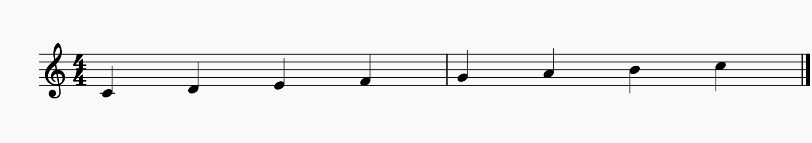
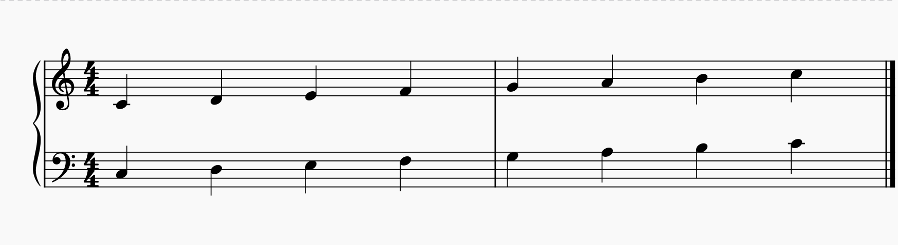
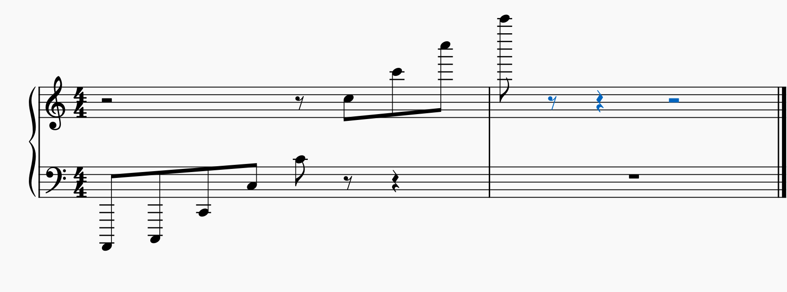
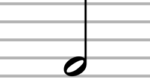
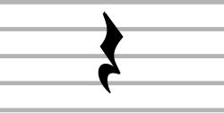
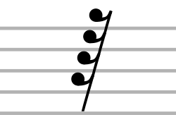
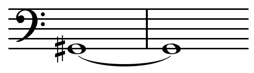
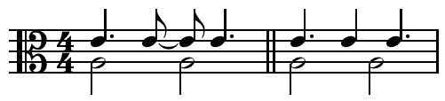
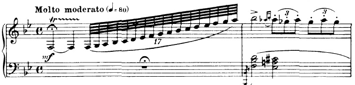
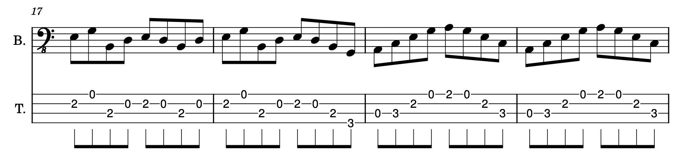

# 6. Cenni di Teoria Musicale

Non possiamo continuare a suonare senza sapere un accidenti di niente sulla musica. Dobbiamo proseguire conoscendo almeno le basi. Quindi, ragazzi, adesso cercheremo di imparare tutti i termini fondamentali che ci serviranno per affrontare seriamente lo studio della <b>teoria musicale</b>, che altri non è che la disciplina che ci aiuta a scrivere, leggere e capire come si <i>muove</i> la musica.
 

Le <b>note</b> sono <b>suoni</b>, e il suono di per sé ha sfumature infinite. Consideriamo le quattro caratteristiche fondamentali del suono: <b>timbro</b>, <b>altezza</b>, <b>durata</b> e <b>intensità</b>.

Il <b>timbro</b> è la caratteristica determinata dallo strumento stesso: un corpo messo in vibrazione possiede peculiarità acustiche legate al materiale di cui è composto. Se sollecitiamo un pezzo di legno o di metallo percepiamo immediatamente una differenza, a prescindere dalla durata, dall'intensità e dall'altezza del suono prodotto. Se un pianoforte e una chitarra suonano un <b>C4</b>, siamo perfettamente in grado di capire che la nota è la stessa, ma che è emessa da due strumenti diversi: questo è il timbro.

Le altre caratteristiche (<b>altezza</b>, <b>durata</b> e <b>intensità</b>) possono essere trascritte per poter poi essere rilette e riprodotte. Nei secoli si sono sviluppati diversi sistemi di scrittura musicale, e un paio di questi sono giunti fino a noi con grande successo: il <b>pentagramma</b> e l'<b>intavolatura</b>.

Il <b>pentagramma</b> è il sistema di notazione universale per eccellenza, valido per quasi tutti gli strumenti e per la voce. È composto da cinque linee parallele formate da cinque <b>righi</b> (non righe, <i>righi</i>) separati da quattro <b>spazi</b>. Una <b>nota</b> viene rappresentata graficamente con una <b>testa</b>, un <b>gambo</b> e, quando necessario, una o più <b>codette</b> (o tagli) che ne determinano la durata. L'<b>altezza</b> della nota è invece <b>determinata dal rigo o dallo spazio sul quale la testa poggia</b>. Tale altezza <b>può essere modificata dalle alterazioni</b> (gli accidenti musicali), scritte a sinistra della nota stessa. L'intensità, infine, si indica tramite appositi simboli dinamici.

Quello che segue è un pentagramma semplice in chiave di violino, utilizzato solitamente per trascrivere le note del registro medio-acuto (come per flauto o violino). Le note raffigurate a titolo d'esempio sono <b>C4</b>, <b>D4</b>, <b>E4</b>, <b>F4</b>, <b>G4</b>, <b>A4</b> e <b>B4</b>.

Quest'altro invece è un <b>doppio pentagramma</b> (o <i>gran pentagramma</i>), formato dall'unione di due pentagrammi affiancati da una parentesi graffa. Viene utilizzato per trascrivere le partiture di strumenti con un registro molto ampio, come il pianoforte e l'arpa. Le note sul pentagramma inferiore (in chiave di basso) rappresentano il registro più grave (come <b>C3</b>, <b>D3</b>, <b>E3</b>, <b>F3</b>, <b>G3</b>, <b>A3</b> e <b>B3</b>), mentre quello superiore (in chiave di violino) ospita le note del registro acuto (come <b>C4</b>, <b>D4</b>, <b>E4</b>, <b>F4</b>, <b>G4</b>, <b>A4</b> e <b>B4</b>).

> [!WARNING]
> 

<b>Non va suonata prima la riga sopra e poi quella sotto! Bisogna suonare C3 e C4 insieme, D3 e D4 insieme, e così via!</b> Nel doppio pentagramma, infatti, le due righe rappresentano due registri letti in contemporanea (di norma la mano sinistra legge il pentagramma inferiore e la mano destra quello superiore).

La <b>chiave</b> è quel simbolo posto all'inizio di ogni pentagramma che serve a fissare la posizione di una nota di riferimento, determinando così il registro (grave o acuto). Le chiavi più comuni sono la chiave di <b>violino</b> (o chiave di SOL) per il registro acuto — quella caratterizzata dal ricciolo finale — e la chiave di <b>basso</b> (o chiave di FA) per il registro grave — quella a forma di C rovesciata affiancata da due puntini. Ricordando che i righi si contano sempre dal basso verso l'alto: la chiave di violino poggia sul <b>secondo rigo</b> (fissando la nota <b>G4</b>, ovvero il SOL subito sopra il DO centrale <b>C4</b>), mentre la chiave di basso si attesta sul <b>quarto rigo</b> (fissando la nota <b>F3</b>, ossia il FA che precede il <b>C4</b>).

Esiste anche una terza chiave, la chiave di <b>DO</b> (dalla caratteristica forma a doppio archetto centrale), utilizzata per gli strumenti a registro intermedio (come la viola) e nella notazione antica dei setticlavii per le estensioni vocali (soprano, mezzosoprano, contralto, tenore, baritono e basso). La linea centrale della chiave di DO individua sempre ed esattamente la nota <b>C4</b> (il DO centrale): idealmente, nel gran pentagramma si colloca nello spazio virtuale intermedio che separa la chiave di basso da quella di violino.

> [!WARNING]
> 
<b>Per scrivere le note per il basso elettrico si usa la chiave di basso! Ma dovete saper leggere anche la chiave di violino, non avete scuse!</b>

Come si può vedere, ci sono due scale che vanno da C a B: quella dell'ottava 3 (da C3 a B3) e quella dell'ottava 4 (da C4 a B4). Noterete subito che le note si posizionano in punti completamente diversi sui rispettivi pentagrammi: il <b>C4</b> si trova sul primo taglio addizionale sotto il rigo della chiave di violino, mentre il <b>C3</b> si trova nel secondo spazio dal basso in chiave di basso. Dite la verità: speravate che le note occupassero gli stessi righi anche in chiavi diverse, vero?

Quando una nota è più acuta o più grave rispetto alle cinque linee del pentagramma, si utilizzano i <b>tagli addizionali</b> (piccole linee orizzontali che estendono provvisoriamente il rigo). Il <b>C4</b> (il DO centrale) costituisce il punto d'incontro perfetto: corrisponde al primo taglio addizionale sopra il rigo in chiave di basso e al primo taglio addizionale sotto il rigo in chiave di violino. Nelle figure precedenti potete notare infatti che la testa della nota C4 appare "tagliata" in due da un piccolo segmento. Qualora l'estensione dello strumento lo richieda, si possono aggiungere ulteriori tagli addizionali sia verso l'alto che verso il basso. Guardate qui:

Questa figura mostra la posizione (rispetto a ciascuna chiave) della nota più grave dello strumento (<b>A0</b>) e di tutti i <b>C</b> appartenenti alle ottave definite come udibili per l'orecchio umano (da <b>C1</b> fino a <b>C8</b>).

La <b>durata</b> di una nota (o di una pausa) è indicata dalla figura musicale stessa e viene espressa in valore relativo (un quarto, un ottavo, ecc.). Più avanti sarà del tutto chiaro a cosa si riferiscano queste frazioni. Graficamente le note possono avere la testa "vuota" o "piena" ed essere dotate o meno di un gambo, con o senza una o più codette. Per convenzione di scrittura, la direzione del gambo è rivolta verso l'alto (a destra della testa) se la nota si trova al di sotto del rigo centrale, oppure verso il basso (a sinistra della testa) se la nota si trova dal rigo centrale in su.

<table>
  <thead>
    <tr>
      <th>NOTA</th>
      <th>PAUSA</th>
      <th>NOME</th>
      <th>VALORE</th>
    </tr>
  </thead>
  <tbody>
    <tr>
      <td align="center"></td>
      <td align="center"></td>
      <td>Massima</td>
      <td>8</td>
    </tr>
    <tr>
      <td align="center"></td>
      <td align="center"></td>
      <td>Lunga</td>
      <td>4</td>
    </tr>
    <tr>
      <td align="center"></td>
      <td align="center"></td>
      <td>Breve</td>
      <td>2</td>
    </tr>
    <tr>
      <td align="center"></td>
      <td align="center"></td>
      <td>Semibreve</td>
      <td>1</td>
    </tr>
    <tr>
      <td align="center"></td>
      <td align="center"></td>
      <td>Minima</td>
      <td>1/2</td>
    </tr>
    <tr>
      <td align="center"></td>
      <td align="center"></td>
      <td>Semiminima</td>
      <td>1/4</td>
    </tr>
    <tr>
      <td align="center"></td>
      <td align="center"></td>
      <td>Croma</td>
      <td>1/8</td>
    </tr>
    <tr>
      <td align="center"></td>
      <td align="center"></td>
      <td>Semicroma</td>
      <td>1/16</td>
    </tr>
    <tr>
      <td align="center"></td>
      <td align="center"></td>
      <td>Biscroma</td>
      <td>1/32</td>
    </tr>
    <tr>
      <td align="center"></td>
      <td align="center"></td>
      <td>Semibiscroma</td>
      <td>1/64</td>
    </tr>
    <tr>
      <td align="center"></td>
      <td align="center"></td>
      <td>Fusa</td>
      <td>1/128</td>
    </tr>
    <tr>
      <td align="center"></td>
      <td align="center"></td>
      <td>Semifusa</td>
      <td>1/256</td>
    </tr>
  </tbody>
</table>

Le note vengono raggruppate in <b>misure</b> (o <b>battute</b>) separate da linee verticali che attraversano il pentagramma. L'<b>indicazione di tempo</b> stabilisce la suddivisione metrica e il ritmo con cui pulsa il brano: viene posta all'inizio della composizione, subito dopo la chiave, ed è espressa sotto forma di frazione. Tale frazione indica quante e quali figure musicali (note e pause) possono essere contenute al massimo in ogni misura, definendone la struttura in <b>movimenti</b> (o <i>quarti/tempi</i>). Il numeratore indica il numero di movimenti presenti in una misura, mentre il denominatore indica il valore/durata di ciascun movimento. Ad esempio, un tempo di <b>4/4</b> indica una misura formata da 4 semiminime (o da un insieme di note e pause la cui somma equivalga a 4/4). Un tempo di <b>12/8</b> indica una misura composta da 12 crome (o equivalenti).

Le durate delle figure musicali si basano su un sistema di proporzioni frazionarie a partire da un intero (la semibreve). Figure antiche di durata superiore alla misura — come la <i>massima</i>, la <i>lunga</i> e la <i>breve</i> — <b>non si usano più nella notazione moderna</b>. Se si deve prolungare un suono oltre il limite di una misura, si utilizza la <b>legatura di valore</b>, ovvero una linea curva che unisce due o più note della stessa altezza. La legatura di valore può collegare due note all'interno della stessa misura oppure a cavallo di due misure distinte. Attraverso la legatura è possibile ottenere durate irregolari come 9/8 (ad esempio legando una semibreve da 4/4, un quarto da 2/8 e un ottavo da 1/8).

Un altro metodo per prolungare la durata di una nota consiste nell'utilizzare il <b>punto di valore</b>, posizionato a destra della testa della nota (fino a un massimo di tre punti consecutivi). Ciascun punto aggiunge alla nota una durata pari alla metà del valore che lo precede:
<ul>
  <li><b>Un punto</b> aggiunge la metà del valore della nota stessa. <i>Es. Una minima (2/4) col punto dura 2/4 + 1/4 = 3/4.</i></li>
  <li><b>Due punti</b> aggiungono la metà della nota più la metà del primo punto (ossia un ulteriore quarto del valore originale). <i>Es. Una semibreve (4/4) con due punti dura 4/4 + 2/4 + 1/4 = 7/4.</i></li>
  <li><b>Tre punti</b> aggiungono la metà del valore del secondo punto (ossia un ulteriore ottavo del valore originale). <i>Es. Una semiminima (1/4) con tre punti dura 1/4 + 1/8 + 1/16 + 1/32 = 15/32.</i></li>
</ul>

Qualche esempio:

Entrambi gli esempi presentano un tempo di <b>4/4</b>. Nel primo esempio possiamo osservare una nota <b>G#2</b> sostenuta per una durata complessiva di 8/4 (pari a due misure intere). Nel secondo esempio abbiamo due misure scandite da 4 minime (<b>A3</b>) sulla voce inferiore, mentre la voce superiore (<b>E4</b>) presenta una successione di durate articolate: la prima nota dura 3/8 (una semiminima con punto di valore = 1/4 + 1/8), la seconda 1/4 (due crome unite da legatura di valore = 1/8 + 1/8), seguite da altre note da 3/8, 1/4 e 3/8. La matematica torna perfettamente: due minime sommano a 4/4; due semiminime col punto più due crome legate sommano a 4/4 (3/8 + 3/8 + 2/8 = 8/8); due semiminime col punto più una semiminima sommano a 4/4 (3/8 + 3/8 + 2/8 = 8/8).

Attenzione a non confondere i tipi di legature! Oltre a quella di valore, esiste la <b>legatura di portamento</b> (o <i>legatura di fraseggio / legato</i>): è una linea curva posta sopra o sotto due o più note di altezza differente. Il suo scopo è indicare all'esecutore che i suoni vanno eseguiti legati, senza interruzioni d'aria (negli strumenti a fiato) e senza staccare le dita tra una nota e l'altra (sul pianoforte o sugli strumenti ad arco e a tastiera). Quando lo scivolamento tra una nota e l'altra è continuo, l'effetto prende il nome di <b>portamento</b> o <b>glissando</b>.

Un celebre esempio di legatura di fraseggio con portamento/glissando è il famosissimo incipit per clarinetto della <i>Rapsodia in blu</i> di George Gershwin, dove una lunga scala ascensionale di semibiscrome sfocia in un fluido e continuo glissando verso l'acuto:

Attenzione, perché la curva del legato può trarvi in inganno! Vedete quel "3" posto sopra o sotto la curva nelle due figure di tre crome nella seconda misura? Quella non è una legatura di fraseggio, ma una <b>terzina</b> (un gruppo irregolare). Significa che le tre crome vanno eseguite nello spazio di tempo che normalmente occuperebbero due crome, ossia nel valore complessivo di una sola semiminima (1/4, un singolo movimento del metro). Se fate i conti torna tutto, così come torna per la "diciassettina" della prima misura (sì, se guardate bene c'è scritto 17).

Inoltre, non confondete mai il punto del legato (o del punto di valore) con quello dello <b>staccato</b>! Lo staccato è un punto posto sopra o sotto la testa della nota che indica che il suono deve essere eseguito breve e staccato da quello successivo, esattamente l'opposto del legato. Guardate le due terzine della seconda misura: le note recano il punto dello staccato (e paradossalmente sono racchiuse da una parentesi di gruppo), indicando che i tre suoni devono essere eseguiti netti e separati l'uno dall'altro, pur nell'arco temporale complessivo di 1/4. Ricordate: il punto di valore si scrive a fianco della nota, lo staccato sopra o sotto.

Negli esempi di pentagramma (semplice e doppio) consideriamo due misure. All'inizio del rigo troviamo il simbolo dell'indicazione di tempo: la lettera <b>C</b> (che sta per <i>tempo comune</i>), sintesi della frazione <b>4/4</b>. In una misura da 4/4 possiamo inserire una nota da 4/4 (semibreve), due note da 2/4 (minime), quattro da 1/4 (semiminime), otto da 1/8 (crome), sedici da 1/16 (semicrome) e così via, oppure qualsiasi combinazione di note e pause la cui somma algebrica dia esattamente 4/4. Nel nostro esempio figurano infatti 7 note e una pausa da 1/4.

La <b>velocità</b> (o <b>tempo metronomico</b>) stabilisce la durata reale di ciascuna figura musicale. Una nota può durare un quarto, ma un quarto di cosa? Di un secondo? Di un'ora? La velocità viene indicata ponendo la figura musicale di riferimento accanto a un numero che esprime i <b>battiti al minuto</b> (<b>BPM</b>). Ad esempio, in un tempo di 4/4, l'indicazione <i>Semiminima = 120 BPM</i> significa che in un minuto vengono scanditi 120 battiti (due al secondo): ciascun battito (e quindi ciascuna semiminima) dura esattamente mezzo secondo (0,5 s) e in un minuto si eseguiranno esattamente 30 misure intere da 4/4.

Un ultimissimo concetto fondamentale: la <b>dinamica</b>, ossia la modulazione dell'<b>intensità</b> del suono. Ricordate che <b>intensità</b> e <b>volume</b> sono due concetti differenti. L'intensità con cui si sollecita una corda o un tasto modifica l'attacco e il timbro del suono stesso arricchendolo di armonici; il volume, invece, è un parametro dell'amplificazione del segnale che aumenta l'ampiezza dell'onda senza modificarne la struttura armonica originaria. Se suoniamo un accordo di pianoforte delicatamente o con forza, otterremo lo stesso accordo ma con una ricchezza timbrica differente: alzare il volume di un accordo suonato <i>piano</i> non darà mai lo stesso risultato timbrico di un accordo suonato <i>forte</i>. La dinamica si annota sotto il pentagramma con espressioni e sigle in corsivo denominate <b>segni dinamici</b> o <b>segni di espressione</b>. Essi variano dal livello più tenue a quello più intenso: <b><i>ppp</i></b> (più che pianissimo), <b><i>pp</i></b> (pianissimo), <b><i>p</i></b> (piano), <b><i>mp</i></b> (mezzopiano), <b><i>mf</i></b> (mezzoforte), <b><i>f</i></b> (forte), <b><i>ff</i></b> (fortissimo), <b><i>fff</i></b> (più che fortissimo). Le variazioni di dinamica possono essere improvvise (spesso indicate dal termine <b><i>subito</i></b>) oppure progressive, segnalate dai termini <b><i>crescendo</i></b> e <b><i>diminuendo</i></b> (talvolta accompagnati da <b><i>a poco a poco</i></b>) o dalle "forcelle" (linee divergenti per il <i>crescendo</i>, convergenti per il <i>diminuendo</i>). Potete osservare un esempio di forcella sopra la minima nella seconda misura della <i>Rapsodia in blu</i>. Mentre il tempo metronomico è una misura fisica rigida, la dinamica è puramente relativa e affidata alla sensibilità interpretativa del musicista.

L'altro sistema di notazione diffuso è l'<b>intavolatura</b>. Mentre il pentagramma indica l'altezza teorica della nota emessa, l'intavolatura indica la posizione fisica delle dita sulla tastiera di uno strumento a corda (come basso, chitarra, liuto o tiorba). Nel caso del basso elettrico è composta da 4 (o 5) linee orizzontali che rappresentano le 4 (o 5) corde dello strumento: la linea superiore rappresenta la corda più acuta (G) e quella inferiore la corda più grave (E o B). Il numero riportato su ciascuna linea indica il tasto da premere (il numero 0 indica la corda suonata a vuoto), mentre sotto il rigo si può specificare la digitazione della mano sinistra (numeri da 1 a 4 per indice, medio, anulare e mignolo). Esistono inoltre simboli specifici per indicare le varie tecniche esecutive (hammer-on, pull-off, slide, slap, ecc.). A torto si ritiene che l'intavolatura sia un'invenzione moderna per musicisti pigri: essa risale in realtà al XV secolo per strumenti a pizzico ed intavolature d'organo, mentre il pentagramma si è consolidato a partire dal IX-XI secolo. Il mio consiglio è di utilizzare l'intavolatura all'inizio principalmente come supporto pratico alla lettura del pentagramma; ometto in questa sede i simboli complessi di durata e articolazione propri delle TAB avanzate, in quanto a mio avviso trovano una rappresentazione ben più chiara e rigorosa direttamente sul pentagramma. Ecco un esempio di notazione combinata con pentagramma ed intavolatura:

> [!WARNING]
> 
<b>Attenzione ai termini anglosassoni! Non sono tutti falsi amici, ma è fondamentale conoscerli con precisione.</b>

Se vi capita tra le mani un manuale o uno spartito in lingua inglese, vi sarà utilissimo conoscere i seguenti termini corrispondenti:

<ul>
  <li>Il pentagramma si dice <b>staff</b> (<b>stave</b> al plurale);</li>
  <li>L'intavolatura si dice <b>tablature</b> (abbreviata in <b>tab</b>);</li>
  <li>L'altezza del suono si dice <b>pitch</b>;</li>
  <li>La durata si dice <b>duration</b>;</li>
  <li>L'alterazione si dice <b>accidental</b>;</li>
  <li>La chiave si dice <b>bass clef</b> per la chiave di basso e <b>treble clef</b> per la chiave di violino;</li>
  <li>La tonalità (o armatura di chiave) si dice <b>key signature</b>;</li>
  <li>La misura o battuta si dice <b>measure</b> o <b>bar</b>;</li>
  <li>L'indicazione di tempo (il metro) si dice <b>time signature</b>;</li>
  <li>Il battito/movimento si dice <b>beat</b>;</li>
  <li>La legatura di valore si dice <b>tie across the barline</b> quando lega note tra due misure diverse o <b>tie across the beat</b> all'interno della stessa misura;</li>
  <li>Il punto di valore si dice <b>augmentation dot</b> mentre la nota col punto si definisce <b>dotted note</b>;</li>
  <li>La legatura di frase o di legato si dice <b>slur</b> mentre l'effetto esecutivo tipo glissando si dice <b>legato</b>;</li>
  <li>La terzina si dice <b>triplet</b>;</li>
  <li>Lo staccato si dice <b>staccato</b>;</li>
  <li>La velocità d'esecuzione del brano si dice <b>tempo</b> e si misura in <b>BPM</b> (<i>beats per minute</i>);</li>
  <li>La dinamica si dice <b>dynamics</b> mentre in ambito informatico la velocità di attacco del tasto è detta <b>velocity</b>;</li>
  <li>Il diesis si dice <b>sharp</b> (simbolo ♯);</li>
  <li>Il bemolle si dice <b>flat</b> (simbolo ♭);</li>
  <li>Il bequadro si dice <b>natural sign</b> (simbolo ♮).</li>
</ul>
