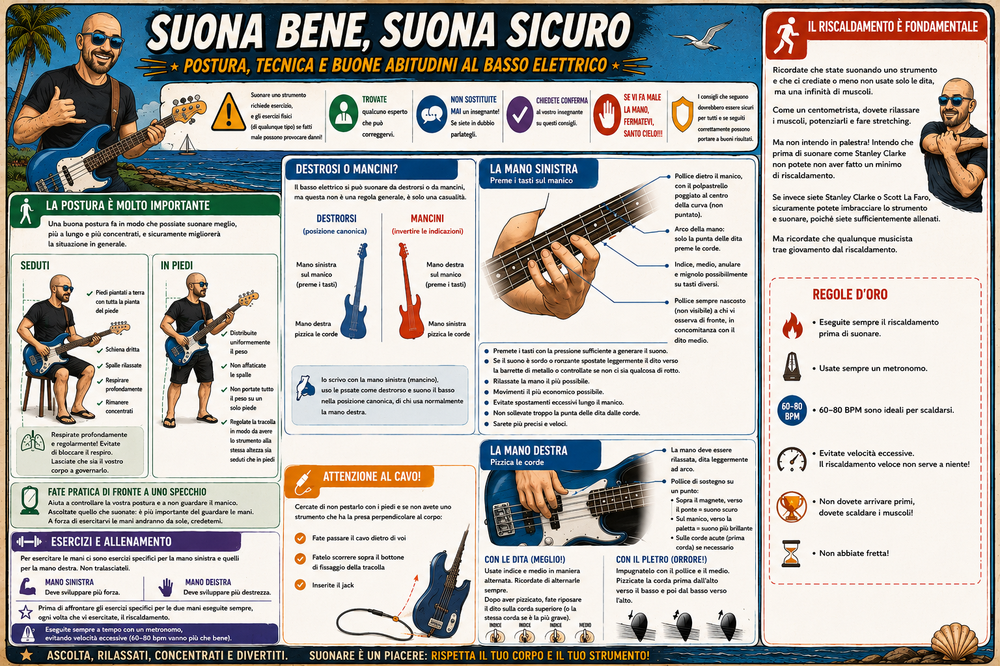

# 6. Postura, Mani e Riscaldamento

Suonare uno strumento richiede esercizio, e gli esercizi fisici (di qualunque tipo) se fatti male possono provocare danni! Quindi ripeto: trovate qualcuno esperto che può correggervi. Non sostituite mai un insegnante! Se siete in dubbio parlategli di questi consigli e chiedete conferma! Se vi fa male la mano, fermatevi, santo cielo!!! I consigli che seguono dovrebbero essere sicuri per tutti e se seguiti correttamente possono portare a buoni risultati.

La postura è molto importante. Sembra una banalità, ma provate a sfidarmi su questo punto. Molto spesso si suona e non si bada alla postura e questa, a volte, piano piano se ne va. Una buona postura fa in modo che possiate suonare meglio, più a lungo e più concentrati, e sicuramente migliorerà la situazione in generale.

Quando suonate seduti, cercate di tenere i piedi piantati a terra con tutta la pianta del piede, tenere la schiena diritta, le spalle rilassate, respirare profondamente e rimanere concentrati. Sebbene siano tutte ovvietà, sono tutte cose molto importanti che aiutano a suonare in maniera efficiente.

Voglio insistere su questo punto, perché io personalmente ho tratto molto giovamento: respirate profondamente e cercate di farlo regolarmente! In pratica evitate quelle tensioni che vi portano a bloccare il respiro! Tuttavia non concentratevi troppo sul respirare, vi distrarrebbe in maniera eccessiva. Lasciate che sia il vostro corpo a governare il respiro, ma non lasciate che prenda il sopravvento o che il meraviglioso meccanismo della respirazione naturale si interrompa. Se non avete patologie della respirazione, non dovete preoccuparvi di fare né di più, né di meno.

Fate pratica di fronte a uno specchio se potete: aiuta a controllare la vostra postura e a non guardare il manico. Se quando fate pratica guardate le vostre mani, le vostre orecchie ascolteranno solo la minima parte di quello che fate. Cercate, se potete, di non guardare le mani se potete e concentratevi invece ad ascoltare quello che suonate. È molto più importante ascoltare il suono che esce piuttosto che osservare le mani che si muovono. A forza di esercitarvi le mani andranno da sole, credetemi.

Quando suonate in piedi cercate di distribuire uniformemente il peso dello strumento senza affaticare le spalle o portare tutto il peso su un piede solo. Inoltre regolate la tracolla in modo da avere lo strumento alla stessa altezza sia che siate seduti, sia che siate in piedi. Fate attenzione al cavo! Cercate di non pestarlo con i piedi e se non avete uno strumento che ha la presa perpendicolare al corpo cercate di far passare il cavo dietro di voi, fatelo scorrere sopra il bottone di fissaggio della tracolla e inserite il jack.

Il basso elettrico si può suonare da destrorsi o da mancini, ma questa non è una regola generale, è solo una casualità. Io ad esempio scrivo con la mano sinistra (quindi teoricamente sarei un mancino), ma uso le posate come un destrorso e suono il basso nella posizione canonica, di chi usa normalmente la mano destra. Faremo tutti finta di essere tutti destrorsi, ma se siete mancini vi basterà invertire le indicazioni da questo punto in poi. La mano sinistra è quella che preme i tasti sul manico, la mano destra è quella che pizzica le corde.

La mano sinistra dovrebbe formare un arco in modo che solo la punta delle dita prema le corde e che le altre falangi non tocchino il manico. Il pollice va posizionato dietro il manico, con il polpastrello poggiato al centro della curva del manico (non puntato). Le dita indice, medio, anulare e mignolo dovrebbero possibilmente trovar posto ogniuna in un tasto del manico e il pollice dovrebbe essere sempre ben nascosto (non visibile) a chi vi guarda di fronte, stando in concomitanza con il dito medio. I tasti vanno premuti con la pressione sufficiente a generare il suono, senza esercitare una pressione eccessiva. Se il suono è sordo o ronzante spostate leggermente il dito verso la barbetta di metallo o controllate se non ci sia qualcosa di rotto nel vostro manico. Rilassate la mano il più possibile. Ricordate sempre che il movimento della mano deve essere il più economico possibile. Evitate quanto più possibile lo spostamento eccessivo della mano lungo il manico e cercate di non sollevare troppo la punta delle dita dalle corde. In questo modo sarete più precisi e veloci.

La mano destra segue lo stesso principio della mano sinistra: deve essere rilassata! Non dovete stare con i muscoli tesi e non dovete avere le dita troppo stirate ma leggermente ad arco. Il pollice deve poggiare su un punto per essere di sostegno alla mano. Si può poggiare sopra il magnete e verso il ponte per avere un suono scuro, oppure sul manico verso la paletta per avere un suono più brillante. Quando suonate le corde acute potete poggiarlo anche sulla prima corda. Per pizzicare le corde potete usare un plettro (orrore!) impugnandolo con il pollice e il medio e pizzicando la corda prima dall'alto verso il basso e poi dal basso verso l'alto, oppure (molto meglio!) usare le dita indice e medio in maniera alternata. Ricordate di alternarle sempre. È un ottimo modo per esercitarsi a ottenere un suono uniforme e per avere maggiore destrezza e precisione essendo, di conseguenza, più versatili. Dopo che il dito (indice o medio) ha pizzicato la corda, fatelo riposare sulla corda superiore (o la corda stessa se è la più grave).

Il riscaldamento è fondamentale. Ricordate che state suonando uno strumento e che ci crediate o meno non usate solo le dita, ma una infinità di muscoli. Come un centometrista, dovete rilassare i muscoli, potenziarli e fare stretching. Ma non intendo in palestra! Intendo che prima di suonare come Stanley Clarke non potete non aver fatto un minimo di riscaldamento. Se invece siete Stanley Clarke o Scott La Faro, sicuramente potete imbracciare lo strumento e suonare, poiché siete sufficientemente allenati. Ma ricordate che qualunque musicista trae giovamento dal riscaldamento.

Per esercitare le mani ci sono esercizi specifici per la mano sinistra e quelli per la mano destra. Non tralasciateli. L'allenamento è un po' diverso per la sinistra e per la destra: la sinistra deve sviluppare più forza e a destra deve sviluppare più destrezza. Però prima di affrontare gli esercizi specifici per le due mani eseguite sempre, ogni volta che vi esercitate, il riscaldamento. Cercate di eseguirlo sempre a tempo con un metronomo, evitando velocità eccessive (60-80 bpm vanno più che bene). Il riscaldamento veloce non serve a niente! Non dovete arrivare primi, dovete scaldare i muscoli! Non abbiate fretta!

