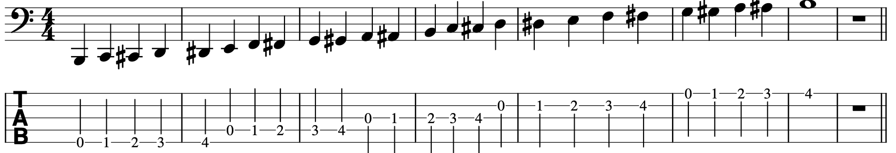

# 7. La Scala Cromatica

Che cos'è una scala? <b>Una scala è un arrangiamento di note in un ordine specifico di intervalli di toni e semitoni.</b>

La <b>Scala Cromatica</b> è una scala musicale composta <b>da tutti e dodici i semitoni del sistema temperato</b>, la cui estensione copre tutti i suoni compresi in un ottava. <b>Quindi la scala cromatica è la scala che contiene tutte le altre scale.</b> Parte da una qualsiasi nota e arriva alla stessa nota dalla quale è partita, un'ottava sopra. Tuttavia, la scala cromatica completa non ha una validità dal punto di vista dell'armonia e della melodia, non viene quasi mai usata nella sua intera estensione, se non nei casi in cui si intende riprodurre l'effetto di un glissando, con strumenti che non possono modulare in maniera continua i suoni, come il pianoforte.

Conoscere e suonare in continuazione la scala cromatica è il pane quotidiano per qualsiasi musicista. Padroneggiare la tastiera tasto per tasto (sia pianoforte che basso elettrico, ma anche chitarra, violino, contrabbasso, ecc…) è la prima preoccupazione che dovreste avere. E come si fa? Bisogna provare provare provare…

È l'esercizio che non vi abbandonerà mai. Suonare tutte le note con tutte e quattro le dita della mano sinistra sui primi quattro tasti della tastiera, partendo sempre dalla corda a vuoto, in modo ascendente e discendente, progressivo o inverso.

Per esplorare tutte le possibili manualità in questo senso è utilissimo il metodo dei <b>pattern</b>. Un pattern ha a che fare più con la <b>diteggiatura</b> che con la musica o le strutture armoniche e melodiche. Le corde del basso elettrico sono accordate in modo che fra di loro ci sia sempre lo stesso schema. Questo significa, ad esempio, che quando si fa una scala qualsiasi, le dita della mano sinistra si muovono in un certo modo e che per fare la stessa scala mezzo tono sopra è sufficiente fare lo stesso movimento delle dita della mano sinistra, spostandola di un tasto verso destra, aumentando cioè, tutte le note di un semitono, rispettando gli stessi intervalli.

Contemporaneamente a questo state anche cominciando a fare un po' di <i>ear training</i>. Il vostro orecchio (e quindi il vostro cervello) si sta rendendo conto che lo schema si ripete anche relativamente al suono. Se infatti vi capita (e vi capiterà) di premere il tasto sbagliato non ve ne accorgete tanto perché state guardando le vostre mani (perché lo sapete che dovete evitare di guardarvi le mani, vero?) ma perché sentite che qualcosa non va.

Cercate <b>sempre</b> di sentire quello che state suonando e di familiarizzare con i suoni e cercate, anche se lo farete inconsciamente, di percepire le similitudini e di aiutarvi con la melodia di quello che state suonando.

Tornando alla scala cromatica, se siete sufficientemente pronti, cimentatevi con gli esercizi che seguono:

[Riscaldamento e Stretching](pdf/riscaldamento-e-stretching.pdf)

## Esercizio sulla Scala Cromatica (S.C.)

Nel primo esercizio tutto è semplice e lineare. In pratica si tratta di suonare una scala cromatica dal B1 o E2 al B3 (quindi dalla quinta/quarta corda a vuoto fino ad arrivare alla prima corda quarto tasto) in senso ascendente. Dove si trova la battuta vuota potete fermarvi oppure proseguire in senso discendente. Potete anche partire dal B3 e scendere verso il B1 o E2 e ricominciare in senso ascendente. Più lo farete e meglio sarà!

## Esercizi di Riscaldamento e Stretching (R.M.S., R.M.D., S.M.S. e S.M.D.)

Di seguito ci sono 4 esercizi: 2 di riscaldamento e 2 di stretching. Ricordatevi: controllate sempre la postura prima di cominciare, mettete un tempo di metronomo comodo, fate prima i due esercizi di riscaldamento, poi quelli di stretching e l'esercizio proposto. Insisto: eseguite sempre questa routine prima di cominciare ogni esercizio che verrà proposto. Gli esercizi sono proposti e spiegati per il basso a 5 corde ma sono facilmente adattabili per il basso a 4 corde.

## Riscaldamento Mano Sinistra (R.M.S.)

Eseguite il primo esercizio di riscaldamento della mano sinistra: avviate il metronomo a 60 o 80 bpm e sul primo battito e premete con l'indice della mano sinistra la nota alla quinta corda (o quarta corda) primo tasto e aspettate tre battiti. Successivamente, senza sollevare l'indice, premete con il medio sul secondo tasto e aspettate tre battiti. Nella stessa maniera, proseguite con l'anulare sul terzo tasto e il mignolo sul quarto.

Al diciassettesimo battito alzate (poco!) le dita e rimettete l'indice sulla quinta corda (o quarta corda) primo tasto. Proseguite fino al mignolo sempre alla stessa maniera (senza alzare le dita già poggiate e aspettando quattro battiti), ma il mignolo poggerà non sulla stessa corda ma sulla corda sotto premendo il quarto tasto.

L'esercizio prosegue al trentatresimo battito. Alzate (poco!) le dita e rimettete l'indice sulla quinta corda (quarta corda) primo tasto. Proseguite fino all'anulare, che stavolta premerà il secondo tasto sulla corda sotto e il mignolo sempre il quarto tasto sulla corda sotto. Al quarantanovesimo rimettete l'indice al punto di partenza e il medio invece sul secondo tasto ma alla corda sotto e le altre dita a seguire sempre sulla corda sotto. Al sessantacinquesimo battito eseguite l'esercizio scendendo di una corda (la quarta o la terza) e proseguite sulla stessa corda. All'ottantesimo i primi tre stasti sulla stessa corda e il mignolo sulla corda sotto e così via. L'esercizio finisce a duecentoventiquattro battiti (per il basso a 5 corde) e duecentotto battiti (per il basso a 4 corde), con l'indice, il medio, l'anulare e il mignolo della mano sinistra sulla corda più acuta.

Come dite? Non è uscito nessun suono? Certo! Nessuno vi ha detto di suonare!

## Riscaldamento Mano Destra (R.M.D.)

Adesso suonerete ben quattro note! E se usate il basso a 5 corde suonerete ben cinque note! Sempre a tempo di metronomo intorno ai 60-80 bpm, suonate la quinta o quarta corda a vuoto per sedici volte, alternando le due dita, poi la quarta o terza, poi la terzo o la seconda e poi la seconda o prima e via dicendo. Fatto questo eseguite il tutto a rovescio.

## Stretching Mano Sinistra (S.M.S.)

Dopo aver riscaldato le mani bisogna "stiracchiarle". Eseguite questo esercizio suonando questo pattern con l'indice, la seconda nota con il medio senza staccare l'indice e la terza con il mignolo senza staccare le altre due. Sentirete sicuramente i muscoli che si stano stirando. Tenendo questa posizione suonate anche la quarta nota, a tempo. Alzate le dita (poco!) e ripetete la stessa posizione al secondo tasto per altre due misure, poi al terzo e poi al quarto. Dopo ripetete la stessa cosa ma partendo dal primo tasto prima corda.

## Stretching Mano Destra (S.M.D.)

Eseguite questo esercizio suonando a tempo le prime 16 note seguendo il pattern con indice, medio, anulare e mignolo della mano sinistra, usandoli uno a uno senza staccarli e alternando indice e medio della mano destra. Dopodiché fate scivolare la mano sinistra in modo che l'indice vada sul quinto tasto e procedete allo stesso modo per le altre 16 note. Ripetete la stessa cosa con le altre corde.

## Altri esercizi sulla scala cromatica

Come vi sarete resi conto questi esercizi hanno una valenza squisitamente tecnica e non musicale. Tuttavia sono importanti e sono stati costruiti per padroneggiare l'intero manico. Sono esercizi che cercano di toccare tutti i tasti e le corde a vuoto, per permettere di creare una <b>memoria muscolare</b> in grado di collegare subito il pensiero all'azione.

Quindi qui di seguito ecco altri esercizi sempre basati sulla scala cromatica.

Se osservate l'intavolatura vi renderete conto dello schema delle note da eseguire con le dita. Se invece osservate il pentagramma vi renderete conto del cammino che intraprenderete. Le note seguono una strada, come fossero delle impronte di passi che salgono e scendono delle scale (e in effetti la metafora calza). Fate caso che quando una nota sale verso un altra, il passaggio intermedio si scrive con un diesis. Per esempio da F a G si usa F#. L'inverso succede quando si scende: da G a F si usa Gb. Questo per allenarvi anche a leggere il pentagramma.

A questo proposito un piccolo consiglio: non aggrappatevi sempre all'intavolatura, finirete per essere schiavi dei relativi pattern che il vostro cervello ne ricaverà. Usatela piuttosto come riferimento per posizionare subito le dita. Invece di buttare l'occhio sul numero, guardate il pentagramma e "solfeggiate" la nota. Mentre suonate E2, F2, F#2, G, ecc… e guardate le note sul pentagramma cantate a voce alta (o nella vostra testa) MI, FA, FA DIESIS, SOL, ecc… Cercate di concentrarvi leggendo la nota sul rigo o lo spazio, ascoltando la nota che suonate e cantando il suo nome. Il vostro cervello se la stamperà bene in mente. Imparerà come si chiama la nota, dove si scrive, e che suono ha. Niente male eh?

Ricordate: controllate la postura, impostate il metronomo, fate riscaldamento, stretching e poi gli esercizi. Mentre fate gli esercizi, non guardate le mani, ascoltate quello che suonate e cantatelo.

## Scala Cromatica con pattern a 3 e 4 note ascendenti e discendenti

[Scala Cromatica con pattern ascendenti e discendenti](pdf/scala-cromatica-pattern-ascendenti-e-discendenti.pdf)

Il primo esercizio esercizio (P.3.A. e P.3.D.) utilizza un pattern a 3 note ascendente e poi lo stesso pattern a 3 note discendente. Questo vuol dire che dovete suonare tre note, poi ricominciare dalla seconda nota e farne altre tre, e così via. Come fare tre passi avanti e due indietro con un salto. Una volta raggiunto il B3 ricominciare da quella stessa nota (quindi dovete suonarla due volte) e questa volta eseguite il pattern a 3 discendente.

Il secondo esercizio (P.4.A. e P.4.D.) è simile al primo, ma il pattern è a quattro note. Quindi farete quattro passi avanti e tre indietro con un salto.

## Scala Cromatica con pattern a 3 e 4 note ascendenti e discendenti inversi

[Scala Cromatica con pattern ascendenti e discendenti inversi](pdf/scala-cromatica-pattern-ascendenti-e-discendenti-inversi.pdf)

Qui i gli esercizi (P.3.A., P.3.D., P.4.A. e P.4.D.) usano i pattern a 3 e 4 note, vanno in senso ascendente e discendente, ma il pattern è rovesciato. Suonerete la terza nota, poi la seconda e poi la prima, poi il pattern successivo al contrario, la quarta, la terza e la seconda, e così via.

