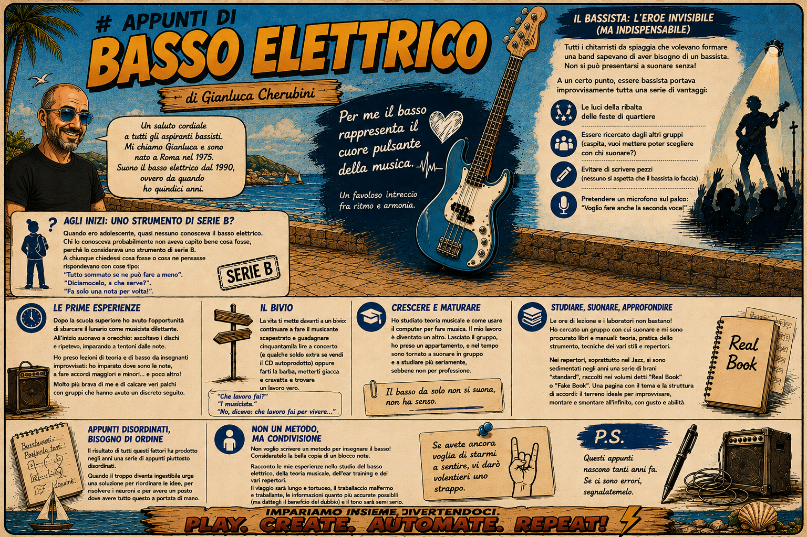

# Appunti di Basso Elettrico
*di Gianluca Cherubini*

Un saluto cordiale a tutti gli aspiranti bassisti. Mi chiamo Gianluca e sono nato a Roma nel 1975. Suono il basso elettrico dal 1990, ovvero da quando ho quindici anni.

Non sono un musicista, ho solamente una grande passione per questo strumento, perché per me rappresenta il cuore pulsante della musica. Un favoloso intreccio fra ritmo e armonia.

Quando ero adolescente, la passione per la musica era una cosa piuttosto comune fra i miei coetanei. Non solo ascoltarla, ma anche suonarla: qualcuno suonava la chitarra elettrica, qualcuno la tastiera e altri ancora la batteria. Alcuni di noi suonavano a scuola, altri ancora suonavano insieme a fratelli o sorelle più grandi, altri con amici, ecc… Era naturale quindi voler formare dei piccoli complessi musicali. <b>Quasi nessuno però conosceva il basso elettrico.</b> Chi lo conosceva probabilmente non aveva capito bene cosa fosse, perché lo considerava uno <i>strumento di serie B.</i>

  

A chiunque chiedessi cosa fosse o cosa ne pensasse rispondeva con cose tipo:
<ul><li>"Tutto sommato se ne può fare a meno".</li><li>"Diciamocelo, a che serve?".</li><li>"Fa solo una nota per volta!".</li></ul>

C'era molta diffidenza e scetticismo a riguardo. A quei tempi tutti volevano cantare o suonare. Tutti volevano essere una rock star! Suonare il basso elettrico, "facendo una sola nota per volta", non era considerata la strada giusta. Nessuno voleva sacrificarsi e di conseguenza non si trovavano bassisti. I giovani chitarristi, al contrario, pensavano di essere un gradino sopra tutti gli altri, soprattutto rispetto ai bassisti. Il cantante era generalmente il leader, per ovvi motivi, ma suonare la chitarra elettrica dava una certa importanza. Anche la chitarra classica da cento mila lire era uno strumento ben considerato: si poteva portarla al parco, a casa di amici, in spiaggia e suonare le canzoni di Battisti. Quindi saper fare pochi semplici accordi e avere una voce mediamente intonata dava l'opportunità di avere fama e gloria fra la gente del quartiere. Il bassista mica lo poteva fare. Il batterista nemmeno. Chi non suonava la chitarra era un perdente, soprattutto i bassisti, perché suonavano una "chitarra che non è una chitarra".

Tuttavia, in fondo al proprio cuore, tutti i chitarristi da spiaggia che volevano formare una band sapevano di aver bisogno di un bassista. Non si può formare un gruppo, preparare un repertorio e presentarsi a suonare alla festa dell'Unità senza bassista. A un certo punto, essere bassista, portava improvvisamente tutta una serie di vantaggi: le luci della ribalta delle feste di quartiere, essere ricercato dagli altri gruppi (caspita, vuoi mettere poter scegliere con chi suonare?), evitare di scrivere pezzi (nessuno si aspetta che il bassista lo faccia) e pretendere un microfono sul palco, che "voglio fare anche la seconda voce".

Qualche anno dopo mi sono ritrovato in quel periodo in cui hai finito la scuola superiore e hai cominciato a lavorare. Ho avuto l'opportunità di sbarcare il lunario come musicista dilettante. Era l'inizio della mia "carriera". A quell'epoca suonavo a orecchio. Vuol dire che ascoltavo i dischi a ripetizione continua, suonando sopra note a casaccio tentando di azzeccarle tutte. Resomi conto che non sarei arrivato molto lontano, ho cominciato a prendere lezioni di teoria musicale e di basso da insegnanti improvvisati. Questo non è stato un esattamente costruttivo: al massimo ho imparato a sapere dove sono le note e che per fare un accordo devo mettere le dita sempre nella stessa posizione. Ah, dimenticavo: mi hanno anche insegnato che serve sapere come si fa un accordo maggiore e uno minore e che tutti gli altri possiamo evitare di saperli, tanto non è che la differenza si senta poi così tanto. Contemporaneamente a tutte queste 'lezioni' ho avuto la fortuna di suonare con gente molto più brava di me che mi ha aiutato a migliorare. Inoltre ho potuto solcare dei veri palchi, suonando dal vivo con gruppi che hanno avuto un discreto seguito.

Tutto questo, ahimè, ha un prezzo, e a un certo punto la vita ti mette davanti a un bivio: continuare a fare il musicante scapestrato e guadagnare cinquantamila lire a concerto (e qualche soldo extra se vendi il CD autoprodotto) oppure farti la barba, metterti giacca e cravatta e trovare un lavoro vero.
<ul><li>"Che lavoro fai?"</li><li>"Il musicista."</li><li>"No, dicevo: che lavoro fai <i>per vivere…</i>"</li></ul>

Quando sono diventato più grandicello, dopo aver superato la fase post-adolescenziale in cui ero bassista, scaricatore di strumenti, venditore di CD autoprodotto, stampatore di spartiti e-altre-mille-cose, ho cominciato a studiare teoria musicale e come usare il computer per fare musica. È stato un periodo piuttosto lungo, sono cresciuto (non troppo, se non di girovita) e sono maturato. Il mio lavoro è diventato un altro. Lasciato il gruppo ho preso un appartamento in affitto per andare a vivere per conto mio. Tutti i miei ex colleghi musicisti venivano a trovarmi come i mercenari ai tempi di Leonardo Da Vinci si recavano al desco del signorotto facoltoso per le libagioni. Da allora è passato un bel pò di tempo, speso a fare un altro lavoro e a cercare di far funzionare aggeggi come quello che ho sottomano adesso mentre scrivo. Da qualche anno a questa parte ho ripreso anche a suonare in gruppo (i chitarristi da spiaggia avevano ragione: il basso da solo non si suona, non ha senso) e quindi di conseguenza, a studiare più seriamente, sebbene non per professione.

Ma come fare fronte a tutte queste esigenze? Le scuole di musica rappresentano una tappa obbligata per chiunque e sono una speranza per chi ormai non può fare affidamento a istituti più accademici. Se hai avuto la fortuna che mamma e papà non ti hanno guardato come un marziano quando a tredici anni hai chiesto loro "voglio fare il conservatorio!", o se anche ti hanno obbligato loro a farlo, COMPLIMENTI! Adesso hai un diploma, anni di pratica alle spalle, puoi misurarti con altri musicisti e tentare di fare una vera carriera! Mio padre non la pensava così: ha preferito suggerirmi una scuola diversa. "…Se poi non ti va di fare l'università almeno puoi fare il metalmeccanico e portare a casa la pagnotta a testa alta!".

Ma, ahimè, le ore di lezione e i laboratori di musica d'insieme non bastano! Che cavolo! Bisogna pur trovare un gruppo con cui suonare no? Oltre a frequentare le lezioni e suonare nei laboratori di musica e/o con diversi gruppi musicali mi sono procurato libri e manuali che spaziano dalla teoria musicale alla pratica dello strumento, alle tecniche dei vari stili e (ultimo ma non meno importante) a repertori vari.

Nei vari repertori, oltre alla prassi esecutiva e alle tecniche stilistiche dei vari strumenti, si sono sedimentati negli anni una serie di brani "standard", soprattutto nel Jazz, raccolti in una altrettanto nutrita serie di volumi detti "Real Book" o "Fake Book". Si tratta di una letteratura piuttosto consistente, che richiede una certa dimestichezza con la musica (il chitarrista da spiaggia potrebbe incontrare qualche difficoltà, se è poco scaltro). Uno standard dei Real Book è una pagina (in genere è una sola) che contiene il tema principale (a volte anche con le parole) e una struttura di accordi dove il musicista più o meno esperto può sbizzarrirsi ad improvvisare, montare e smontare all'infinito, con una serie di regole e tecniche (non tutte scritte) che obbediscono al gusto e all'abilità del musicista stesso. Intrigante, vero?

Il risultato di tutti questi fattori ha prodotto negli anni una serie di appunti piuttosto disordinati. Quando poi il troppo diventa ingestibile urge una soluzione per riordinare le idee, per rispolverare i neuroni e per avere un posto dove avere tutto questo a portata di mano.

Non voglio certo scrivere un metodo per insegnare a suonare il basso elettrico! Io stesso sono ancora ad un livello quasi sufficiente e nonostante me la cavo non mi ritengo certo un musicista abile. Consideratelo la bella copia di un blocco note. Non voglio neanche diventare un giorno un insegnante, non ho i titoli, né l'esperienza per farlo in ambito musicale, l'ho fatto per altre cose, ma non ho tratto molta soddisfazione, soprattutto dopo un po' di anni gli studenti non hanno più quella curiosità che spinge a studiare, pretendono il titolo di studio.

Ebbene, eccomi qui a raccontare le mie esperienze nello studio del basso elettrico, della teoria musicale, dell'ear training e dei vari repertori. Il viaggio sarà lungo e tortuoso, il trabiccolo che vi trasporterà sarà malfermo e traballante, le informazioni che riceverete saranno quanto più accurate possibili (ma dategli il beneficio del dubbio) e il tono sarà semi serio. Se avete ancora voglia di starmi a sentire, vi darò volentieri uno strappo.

**P.S.:** Questi appunti nascono tanti anni fa. Se ci sono errori, segnalatemelo.

**P.P.S.:** Le infografiche sono ovviamente fatte con l'IA. Non sono perfette, quindi non mi segnalate gli errori. Non le rifaccio. Servono solo a visualizzare mentalmente i concetti. E a me vanno bene così.
